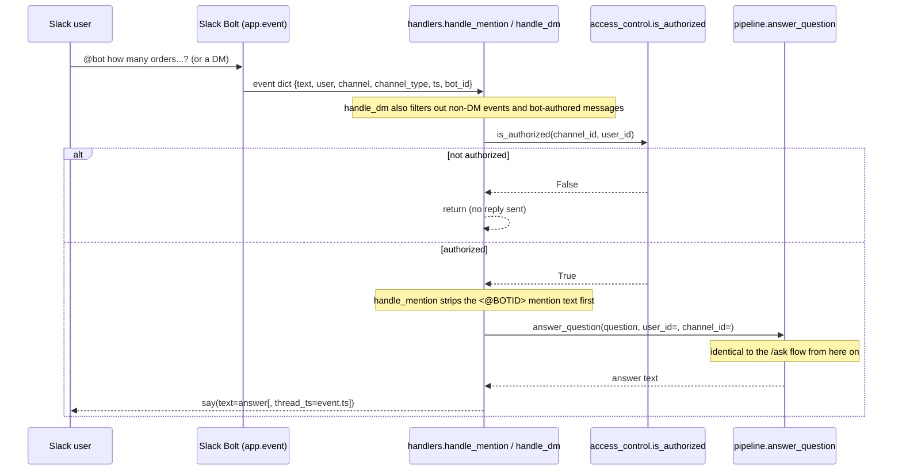
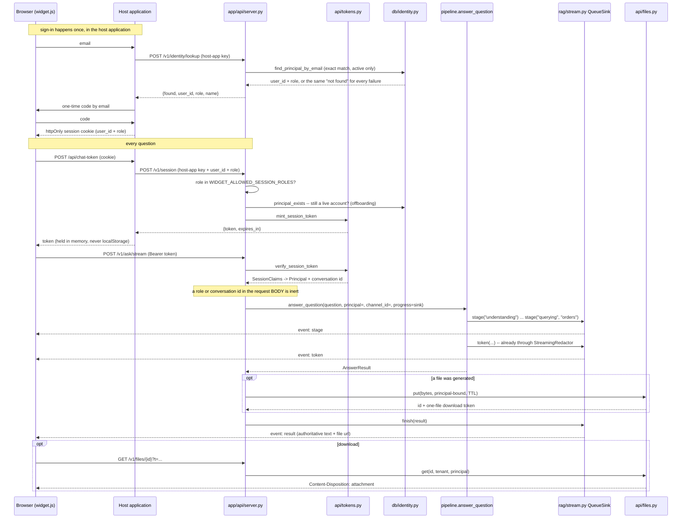

# Architecture & request flow

This traces exactly what happens for a real question end to end: which function calls which, in
order, for every entry point. Generated from the actual import graph in `app/`, not from memory.

There are **two adapters** onto one pipeline — `app/slack/` and `app/api/` — and nothing below
`app/rag/pipeline.py::answer_question` knows which one a question arrived through. Both can run at
once against one database.

**If you only read one section**, read [Component map](#component-map) and
[The agent graph in detail](#the-agent-graph-in-detail) — everything else is detail on top of
those two. For the two policies that decide what an answer may contain, read
[The field policy](#the-field-policy-three-layers-in-order) and
[The row policy](#the-row-policy-roles) — they answer different questions and are enforced in
different places.

## Component map

```mermaid
graph TD
    SlackMain[app/main.py<br/>Socket Mode entrypoint] -->|constructs once, injects| Handlers[app/slack/handlers.py<br/>register_handlers]
    ApiMain[app/api/main.py<br/>gateway entrypoint] -->|constructs once, injects| Server[app/api/server.py<br/>create_app -- FastAPI]

    Slack[Slack: /ask, @mention, DM, /login, /logout] --> Handlers
    Browser[Browser: the embedded widget] --> Server

    Handlers --> AccessControl[app/slack/access_control.py]
    Handlers --> Auth[app/slack/auth.py<br/>mock /login sessions -> a vendor Principal]
    Handlers -->|files_upload_v2, falls back to text| SlackFiles[(Slack file upload)]

    Server --> Tokens[app/api/tokens.py<br/>host-app keys vs browser session tokens;<br/>role + conversation id come from the TOKEN]
    Server --> Identity[app/db/identity.py<br/>the ONE path allowed to read users.email/password_hash]
    Server --> Files[app/api/files.py<br/>bounded TTL store for a generated report]
    Server --> Stream[app/rag/stream.py<br/>QueueSink -> Server-Sent Events]

    Handlers --> Pipeline[app/rag/pipeline.py<br/>answer_question -> AnswerResult]
    Server --> Pipeline

    Pipeline --> IntentRouter[app/services/intent_router.py<br/>regex only, no Gemini:<br/>explicit format + policy refusals]
    Pipeline --> AnswerCache[app/rag/answer_cache.py<br/>keyed by channel + PRINCIPAL SCOPE + format + question<br/>checked first -- a hit skips everything below]
    Pipeline --> RateLimiter[app/rag/rate_limiter.py<br/>sliding window per identity, role-aware<br/>+ DailyQuestionLimiter]
    Pipeline --> Quota[app/llm/quota.py<br/>quota_tracker -- shared daily budget]
    Pipeline --> ClarificationCache[app/rag/clarification_cache.py]
    Pipeline --> ConversationContext[app/rag/conversation_context.py<br/>only read when no clarification is pending]
    Pipeline --> ContextSwitch[app/rag/context_switch_cache.py]
    Pipeline --> Graph[app/agents/graph.py<br/>build_graph / graph.invoke<br/>-- see detail below]
    Pipeline --> Audit[app/audit/logger.py<br/>log_query_event + role + timings]

    Graph --> Classifier[app/agents/classifier.py]
    Graph --> Domains[app/agents/domains.py<br/>domain registry + forced collection/usertype scoping]
    Graph --> Roles[app/security/roles.py<br/>THE row-level policy:<br/>role -> a forced filter per domain]
    Graph --> QueryAgents[app/agents/query_agents.py<br/>per-domain query generation]
    Graph --> Validator[app/rag/validator.py<br/>validate_query_spec]
    Graph --> Executor[app/db/executor.py<br/>execute_query_spec<br/>+ sanitize_rows on every path out]

    Pipeline --> Generators[app/generators/<br/>csv / xlsx / pdf]
    Generators --> Tabular[app/generators/tabular.py<br/>bounded ReportTable, role-aware row cap]
    Generators --> Charts[app/generators/charts.py<br/>rule-based pie/bar/line<br/>Figure API, never pyplot]
    Generators --> RenderPool[app/generators/render_pool.py<br/>bounded pool + timeout]
    Pipeline --> OutputScanner[app/security/output_scanner.py<br/>scan_output_for_pii + StreamingRedactor]

    FieldPolicy[app/security/field_policy.py<br/>THE field allow/deny policy] --> SchemaCtx
    FieldPolicy --> Validator
    FieldPolicy --> Executor

    QueryAgents --> SchemaCtx[app/rag/schema_context.py<br/>build_domain_schema_context<br/>mtime-cached, denied fields hidden]
    SchemaCtx --> SummaryFile[(schema_summary.json)]
    SchemaCtx --> AnnotationsFile[(schema_annotations.json)]

    Classifier --> Gemini[app/llm/gemini_client.py<br/>GeminiClient<br/>shared singleton, not per-request]
    QueryAgents --> Gemini
    Graph -->|generate_answer / stream_answer| Gemini

    Gemini --> CircuitBreaker[app/llm/circuit_breaker.py<br/>per-model, fails fast on a sustained outage]
    Gemini --> QuotaRecord[quota_tracker.record_call]
    Gemini --> GeminiAPI[(Google Gemini API<br/>client-side HTTP timeout, retried on timeout too)]

    Validator --> QuerySpecModel[app/rag/query_spec.py<br/>QuerySpec / QueryError]

    Executor --> Mongo[app/db/mongo.py<br/>get_db / close_client<br/>pooled, timeouts set]
    Identity --> Mongo
    Mongo --> MongoDB[(MongoDB, read-only credential)]
    SlackMain --> Indexes[app/db/indexes.py<br/>ensure_indexes -- idempotent, called at startup]
    ApiMain --> Indexes
    Indexes --> MongoDB

    AnswerCache --> State
    RateLimiter --> State
    Quota --> State
    ClarificationCache --> State
    ConversationContext --> State
    ContextSwitch --> State
    CircuitBreaker --> State
    Files --> State
    Auth --> State
    State[app/state/<br/>StateBackend: 7 primitives, each atomic in Redis] --> Memory[InMemoryBackend<br/>default -- single replica]
    State -.->|STATE_BACKEND=redis| Redis[(Redis<br/>shared across replicas)]

    Audit --> Stdout[(stdout, JSON lines)]
    Audit -.->|AUDIT_LOG_FILE, optional| AuditFile[(rotating log file)]

    subgraph "Offline / CLI only - not in the live request path"
        Introspect[app/db/introspect.py]
        Seed[app/db/seed.py<br/>app/db/seed_users.py]
        Calc[app/rag/calculation.py<br/>unused by pipeline today]
    end
```



**Note on `app/rag/calculation.py`**: it exists (pure `total`/`average`/`minimum`/`maximum`/`count`
helpers, fully unit tested) but **nothing in the live pipeline calls it**. Math currently happens
one of two ways: Gemini writes aggregation stages (`$sum`, `$avg`, etc.) directly into
`QuerySpec.pipeline`, or Gemini reasons over the raw returned rows when writing the final answer.
`calculation.py` is available for a future Python-side calculation step but isn't wired in.

**Note on client lifecycle**: `GeminiClient` is built once in `app/main.py::main()` and injected
through `register_handlers(app, gemini)` into every handler and, from there, into
`build_graph(gemini)` (cached by identity — see `_get_graph` in `app/rag/pipeline.py` — since
compiling a `StateGraph` isn't free and the graph's structure only depends on which `GeminiClient`
it closes over). So all questions share one `google.genai.Client` instead of paying client-init
cost per question. `answer_question`'s `gemini=None` default exists only so tests can omit it /
pass a stub — production code always passes the shared instance. `MongoClient` is likewise a
process-wide singleton (`app/db/mongo.py::get_client`) with explicit connection timeouts, a
bounded pool, and `close_client()` used on graceful shutdown.

## The field policy: three layers, in order

`app/security/field_policy.py` is the single source of truth for which document fields may leave
the system, **for anyone**. (Which *rows* may leave it for a particular person is a separate
policy — see [The row policy](#the-row-policy-roles).) It distinguishes two actions:

- **drop** — storage plumbing (`_id`, `__v`, index fields) *and* contact details (`email`,
  `phone`, `mobile`, anything matching `_CONTACT_FIELD_PATTERNS`). Key and value both removed.
- **redact** — credential *values* (card numbers, CVVs, passwords, tokens). Key kept, value
  replaced, because the column may legitimately appear in a report.

Contact details are dropped rather than redacted because, unlike a card number, the column isn't
useful either — nobody needs an `email` column full of `[REDACTED]`. They exist so a person can
sign in (`app/db/identity.py`), and that is the only thing they are for: a model that can see a
contact column can be asked to list it, which turns an authentication field into a
contact-scraping endpoint with natural-language search over it. The contact patterns are
deliberately *broader* than the secret ones — a false positive drops one column from a report, a
false negative hands over a contact list.

It is enforced at three points, and the order matters:

| Layer | Where | What it does | Why it isn't enough alone |
|---|---|---|---|
| 1. Hide | `app/rag/schema_context.py` | Filters denied fields out of the schema shown to each domain agent | A model can guess a field name it was never shown |
| 2. Refuse | `app/rag/validator.py::_find_secret_field_reference` | Rejects a spec that references a secret-valued field | Only covers secrets, not internal fields (see below) |
| 3. Strip | `app/db/executor.py` | `sanitize_rows` on every return path | — this is the backstop that cannot be bypassed |

Layer 3 is deliberately at the *entrance* to the application rather than near the user. Every
downstream consumer — the answer prompt, CSV/XLSX/PDF exports, the answer cache, the audit log —
reads what the executor returns, so sanitizing there covers all of them by construction,
including paths added later. The earlier design sanitized after synthesis, which meant the model
had already been handed raw `_id`s and card numbers by the time the filter ran.

Layer 2 checks `is_secret_field` only, **not** the broader `is_denied_field`. `_id` is legitimate
pipeline syntax — a `$group` key is literally named `_id`, and `{"$project": {"_id": 0}}` is the
idiomatic way to exclude it — so rejecting internal fields there would refuse most valid
aggregations while protecting nothing layer 3 doesn't already handle.

## The row policy: roles

`app/security/roles.py` is the sibling of the field policy and answers a different question: not
"which columns may leave the system" but "which records may leave it *for this person*".

A `Principal` (role + user id) reaches the graph, and `_domain_filter` merges the role's forced
filter into every generated query — in code, after generation, exactly the relationship
`scope_spec_to_domain` has to the collection name.

| | orders | customers | vendors |
|---|---|---|---|
| **admin** | all | all | all |
| **vendor** | `vendor_id = self` | the customers who ordered from them | `user_id = self` |
| **customer** | `customer_id = self` | `user_id = self` | the directory, unfiltered |
| **anonymous** | — | — | — |

Three properties are load-bearing, and all three fail *silently* if broken — the query runs, the
answer is fluent, and it is built from rows the asker was never entitled to see:

1. **The default is deny.** The previous design had one axis (`authenticated_vendor_id`) that
   applied no filter when absent, so "not signed in" meant "sees everything". `ANONYMOUS` reads
   nothing, and `_principal(state)` defaults to it — a `Send` payload that forgot to thread the
   principal refuses rather than answering from every row.
2. **An unresolved computed scope becomes `{"$in": []}`, never an absent filter.** A vendor's
   customer set has to be *read* before it can be enforced (`_resolve_authorized_customer_ids`
   runs a distinct aggregation over that vendor's own orders, before the fan-out). Matching
   nothing is a visible failure; matching everything is an invisible one.
3. **An authorization filter is never widened by a geo anchor.** A vendor asking "which of my
   customers are nearby?" must be limited to their own orders *and* the anchor.

Over `RBAC_MAX_AUTHORIZED_IDS`, the domain is **refused** rather than truncated: a truncated scope
answers from an arbitrary subset while looking complete.

Domains a role may not read at all are dropped before any Send is issued, so a refused domain
costs no Gemini call and no Mongo round-trip; the refusal is reported through the existing
per-domain `out_of_scope_by_domain` channel, so a two-domain question answers the half it can.

See [authorization.md](authorization.md) for sign-in, session tokens and the usage limits.

## The web adapter and streaming

`app/api/` is a second adapter, structurally a mirror of `app/slack/handlers.py`: authorize, call
`answer_question`, deliver. What it owns is everything Slack used to provide and a browser
doesn't.

| Slack provides | The gateway provides |
|---|---|
| tells the bot who is speaking | a signed session token; **role and conversation id come from it, never the request body** |
| a channel id | `web:{tenant}:{role}:{principal}`, derived from the token |
| `files_upload_v2` | `GET /v1/files/{id}` — signed, short-TTL, principal-bound (`app/api/files.py`) |
| a message that appears when finished | Server-Sent Events (`POST /v1/ask/stream`) |

**Streaming is a side channel, not a second path.** `answer_question(progress=sink)` takes an
optional `StreamSink` (`app/rag/stream.py`); the graph threads it to every node — including into
each `Send` payload — and `_synthesize_node` streams the model's tokens through it. Slack passes
nothing, gets `NULL_SINK`, and behaves byte-identically. The returned `AnswerResult` is the same
object either way, so the cache, the audit log and the report builder cannot diverge between
adapters.

Streamed tokens go through `StreamingRedactor`, not around it: `scan_output_for_pii` runs on
*finished* prose, which for a stream would arrive long after a card number had been displayed, and
re-scanning each chunk alone catches nothing because a number split across two chunks matches
neither half. The redactor releases text only up to a character no pattern can match.

## Shared state

Every stateful guardrail — the answer cache, the three conversation caches, the rate limiter, the
daily quota, the circuit breaker, the report file store, and the `/login` sessions — keeps its
bytes behind `app/state`'s `StateBackend`. `InMemoryBackend` is the default and reproduces the
previous in-process behaviour exactly; `RedisBackend` shares it across replicas.

The primitive set is deliberately small and chosen so every operation a guardrail needs is
**atomic in the backend**. Read-modify-write over `get`/`set` is a race: two replicas incrementing
a call count both read 9, both write 10, and the budget is silently doubled. So counters go
through `incr` and the sliding window through `allow_in_window`, each a single Lua script Redis
runs to completion.

See [scaling.md](scaling.md) for what breaks without it.

## Report generation

One question produces at most one file. The format is resolved before the graph runs where the
user named it explicitly (regex, `app/services/intent_router.py`) and otherwise comes from
`Classification.output_format`, which rides on the classify call that was happening anyway — no
dedicated Gemini round trip for either the format or a policy refusal.

All three formats share `app/generators/tabular.py`, which fixes column order, applies the
row/column caps, and flattens values once — so a CSV, an XLSX and a PDF of the same question show
the same columns in the same order. Caps that actually bite are stated in the output rather than
truncating silently.

Column order and headers are declared, not inferred. `DomainConfig.report_columns` is the reading
order (Mongo key order is an implementation detail), `report_hidden_columns` drops storage-level
encodings that are correct but unhelpful in a table (`onlinepaymentmethod`, `isWallet`, `payby`),
and `_HEADER_OVERRIDES` supplies the name a person actually uses — "Order #", not "Order ID". So
an `orders` table renders as:

```
Customer Name | Order # | Order Payment | Order Type | Current Status | Vendor Name | ...
```

`customer_name` and `vendor_name` are not stored on an order. `app/agents/enrichment.py` resolves
them from `customer_id`/`vendor_id` after execution, with a single `$in` query over the indexed
`user_id`, and drops the id once its name is in hand. Doing this in code rather than as a
model-authored `$lookup` avoids needing `usertype` scoping inside a generated pipeline — and the
join is identical every time, so there is nothing for a model to decide.

The document title comes from `Classification.report_title`, produced by the classify call that
was happening anyway: "last 10 incomplete order details in csv" titles the file *Last 10
Incomplete Order Details*, falling back to `REPORT_TITLE` when the model has no opinion.

The PDF template is fixed, not model-authored: **title → key insights → chart → data table**. The
insights block reuses the answer the pipeline already synthesized rather than making a second
call, so the document and the on-screen reply cannot disagree. Chart type is chosen by rule from
the data's shape (`charts.py::choose_chart`), with the question used only to prefer a dimension
the user actually named.

Rendering runs on `render_pool.py`, a bounded thread pool with a timeout — WeasyPrint is the
heaviest CPU on the request path, and unbounded it lets every Socket Mode worker render at once.
A render failure is non-fatal: the text answer ships regardless.

## The agent graph in detail

`app/agents/graph.py::build_graph` compiles a LangGraph `StateGraph` (schema in
`app/agents/state.py::GraphState`) that replaces what used to be a single-shot "one Gemini call
picks a collection and writes a query" pipeline. It classifies a question into one or more
*domains* (`orders`, `customers`, `vendors` — see `app/agents/domains.py`), resolves any
cross-domain geo anchor **in code**, fans out one schema-scoped agent per domain **in parallel**,
then synthesizes one answer from every domain's rows:

```mermaid
graph TD
    START --> classify[classify<br/>classify_question -> Classification]
    classify -->|low confidence, no domain,<br/>or model asked to clarify| clarify[clarify] --> END1[END]
    classify -->|context_mode=="new_topic" AND<br/>a previous_question is live| confirm[confirm_context_switch<br/>asks before discarding it -- no query yet] --> END3[END]
    classify -->|confident, and either on-topic<br/>or nothing live to discard| resolve_anchors[resolve_anchors<br/>only does real work for<br/>"vendors near &lt;customer&gt;[, with pending orders]"]
    resolve_anchors -->|Send, one per classified domain,<br/>capped at AGENT_MAX_FAN_OUT| domain_agent["domain_agent (x N, parallel)"]
    domain_agent --> synthesize[synthesize] --> END2[END]
```

- **classify** (`_classify_node` / `classify_question`): a cheap, narrow, enum-constrained call —
  the model only ever names a domain from `DOMAIN_NAMES`, never a raw collection or field, so a
  hallucinated domain fails Pydantic validation rather than being silently accepted. Also creates
  `spec_cache: {}` in state (see the dedup note below). If `state["previous_question"]` is set (the
  last resolved question for this (channel, user), from `app/rag/conversation_context.py`), the
  same call also decides `Classification.context_mode` — `"new_topic"` or `"followup"` — and, if
  `"followup"`, rewrites the question into a self-contained `Classification.resolved_question`
  that folds in only what's needed from the previous turn (e.g. "what about the total amount?"
  after "how many orders did vendor V1 have last week?" becomes "what is the total amount of
  orders vendor V1 had last week?"). `resolved_question` is written into `state["resolved_question"]`
  and every node from here on (`resolve_anchors`, `domain_agent` generation, `synthesize`) works
  against it instead of the raw `question` — see `_effective_question()`. This piggybacks on the
  classify call that already runs on every message, so an unrelated question with nothing live to
  discard costs nothing beyond the classify prompt's fixed few-shot examples: no extra Gemini call,
  and downstream stages see exactly what they would have without this feature. (When context *is*
  live, see **confirm_context_switch** below — that question isn't answered immediately either
  way.)
- **clarify** (`_route_after_classify` / `_clarify_node`): routed here if `confidence` is below
  `AGENT_CLASSIFIER_MIN_CONFIDENCE`, no domain was named, or the classifier itself asked a
  clarifying question (e.g. a geo question with no location given).
- **confirm_context_switch** (`_route_after_classify` / `_confirm_context_switch_node`): routed
  here — checked *after* the clarify conditions above, so a low-confidence/ambiguous question still
  goes to `clarify`, not this — when `Classification.context_mode == "new_topic"` **and**
  `state["previous_question"]` is set. Rather than silently discarding that context (or asking a
  fresh query for something that might have been the wrong call), it sets `answer` to a yes/no
  confirmation prompt and `needs_context_confirmation: True`, and ends the graph immediately — no
  query generated, no `generate_answer` call. `app/rag/pipeline.py` parks the candidate question in
  `context_switch_cache` and interprets the *next* message deterministically (no Gemini call) as
  yes / no / neither — see that module's docstring for the full reply-handling contract. Only
  reachable when there's actually something live to discard; with no `previous_question` a
  `"new_topic"` question goes straight to `resolve_anchors` exactly as it did before this feature
  existed.
- **resolve_anchors** (`_resolve_anchors_node`): a no-op for every question shape except the one
  named cross-domain pattern — "vendors near a customer[, with pending orders]". For that shape
  only: resolves the named customer's coordinates (a real `customers` domain query, not a
  model-invented lat/lng), then, if `orders` is also in play, which vendors are nearby (a real
  `vendors` domain query using those coordinates). This is deliberately *not* a generic multi-hop
  query planner — it's the one named pattern from the design, implemented explicitly, because a
  generic planner would be speculative machinery for cases that don't exist yet.
- **domain_agent** (`_domain_agent_node`, fanned out via `Send`, capped at `AGENT_MAX_FAN_OUT`):
  one invocation per classified domain, run in parallel by LangGraph's own executor (confirmed:
  `langgraph/pregel/_executor.py` uses a thread pool for a superstep's fanned-out tasks — this is
  not something this codebase implements itself). Each: builds a schema-scoped prompt
  (`app/agents/query_agents.py::generate_domain_query_spec`, seeing only its own domain's fields
  via `app/rag/schema_context.py::build_domain_schema_context`) → gets back a `QuerySpec` or
  `QueryError` → `scope_spec_to_domain()` forces the collection + usertype filter in code
  regardless of what the model wrote → `validate_query_spec()` → `execute_query_spec()`.
- **synthesize** (`_synthesize_node`): if every domain came back empty, picks the most useful
  "why" message (a real error beats an out-of-scope rejection beats a generic "no data" message).
  Otherwise calls `gemini.generate_answer()` with rows grouped by domain, and appends a note if
  any domain failed or was out of scope while others succeeded.

**The single most important guardrail**: `scope_spec_to_domain()` (`app/agents/domains.py`)
overwrites the spec's `collection` and `usertype` filter unconditionally, in code, after
generation — so a "vendors" question literally cannot read customer rows even if the model's own
filter forgot, or hallucinated the wrong, discriminator value. This is enforced identically for
every domain agent regardless of what schema/prompt it was given.

**Why a raw generation-time exception is not the same as a `QueryError`**
(`_generate_validate_execute`): the model can emit a shape Pydantic rejects (confirmed in
practice: an explicit `"limit": null` — see `QuerySpec._coerce_explicit_nulls_to_defaults` in
`app/rag/query_spec.py`, which now normalizes exactly this). That's a generation-time bug/model
hiccup, recorded as `errors_by_domain` (surfaced as "I ran into a problem answering that"), and
must not be presented the same way as the model's own deliberate `QueryError` ("I don't have data
for that"), which is recorded as `out_of_scope_by_domain` instead.

**Gemini-call dedup across anchor resolution and fan-out** (`spec_cache` in `GraphState`): for
the cross-domain pattern, `resolve_anchors` generates a `customers` spec (to find the anchor
customer) and, if applicable, a `vendors` spec (to find nearby vendors) — and then the fan-out
step generates specs for `customers`/`vendors`/`orders` *again*, for the final answer. The
`customers` and `vendors` generation calls in both places are identical (same domain, same
question, same geo override — they only ever differ in the `limit` applied *after* generation).
`spec_cache`, created once by `classify` and shared by reference through the `Send` payloads
`_fan_out` builds, memoizes the raw generation result per `(domain, question)` so that Gemini call
only happens once; each call site still deep-copies the cached spec before applying its own
`limit`/geo/id-filter overrides and always runs its own validate/execute independently (never
cached). See the regression test
`tests/test_graph.py::test_cross_domain_pattern_generates_each_domain_spec_only_once`, which
counts generation calls per domain to prove the dedup holds.

## Flow 1: `/ask` slash command

```mermaid
sequenceDiagram
    participant User as Slack user
    participant Bolt as Slack Bolt (app.command)
    participant H as handlers.handle_ask_command
    participant AC as access_control.is_authorized
    participant P as pipeline.answer_question
    participant AN as answer_cache
    participant RL as rate_limiter
    participant Q as quota_tracker
    participant CC as clarification_cache
    participant CX as conversation_context_cache
    participant SW as context_switch_cache
    participant G as agent graph (app/agents/graph.py)
    participant L as audit.log_query_event

    User->>Bolt: /ask how many orders used a wallet?
    Bolt->>H: command dict {text, user_id, channel_id}
    H->>H: ack()
    H->>AC: is_authorized(channel_id, user_id)
    alt not authorized
        AC-->>H: False
        H-->>User: "Sorry, you're not authorized..." (visible denial)
    else authorized
        AC-->>H: True
        H->>H: strip/validate question text
        H->>P: answer_question(question, user_id=, channel_id=)
        alt question is an exact-match reset phrase ("reset"/"new topic"/"start over"/"forget that")
            P->>CC: clarification_cache.clear(...)
            P->>CX: conversation_context_cache.clear(...)
            P->>SW: context_switch_cache.clear(...)
            P->>L: log_query_event(error="context_reset")
            P-->>H: "Got it -- I've cleared our conversation context..." (no Gemini call)
        else not a reset phrase
        P->>SW: context_switch_cache.get((channel_id, user_id))
        alt a confirmation is pending
            Note over SW: the *previous* answer asked "should I clear that context and answer this as a new question?" -- interpret this message as the reply, not a fresh question (still no Gemini call either way)
            alt exact-match yes
                P->>SW: context_switch_cache.clear(...)
                P->>CX: conversation_context_cache.clear(...)
                Note over P: question is replaced with the parked candidate_question and flows into the normal path below, as a clean standalone question
            else exact-match no
                P->>SW: context_switch_cache.clear(...)
                P->>L: log_query_event(error="context_switch_declined")
                P-->>H: "Okay, sticking with our current conversation -- go ahead." (no Gemini call)
            else neither
                P->>SW: context_switch_cache.clear(...)
                P->>CX: conversation_context_cache.clear(...)
                Note over P: stale prompt AND stale context both dropped -- this message is judged fresh, on its own, below
            end
        end
        P->>AN: answer_cache.get(channel_id, question)
        alt cache hit
            AN-->>P: CachedResult
            P->>L: log_query_event(cache_hit=True, answer=..., error=...)
            P-->>H: cached answer (zero Gemini calls, zero quota/rate-limit spent)
        else cache miss
            AN-->>P: None
            P->>RL: rate_limiter.allow((channel_id, user_id))
            alt rate limited
                RL-->>P: False
                P->>L: log_query_event(error="rate_limited")
                P-->>H: "You're asking faster than I can keep up..."
            else within rate limit
                RL-->>P: True
                P->>Q: is_over_budget()
                alt over daily budget
                    Q-->>P: True
                    P->>L: log_query_event(error="daily_budget_exceeded")
                    P-->>H: "I've hit my daily question budget..."
                else under budget
                    Q-->>P: False
                    P->>CC: clarification_cache.get((channel_id, user_id))
                    Note over CC: a pending entry means the *previous* answer was itself a clarifying question -- this message is merged with the original as one "effective_question"
                    alt no clarification pending
                        P->>CX: conversation_context_cache.get((channel_id, user_id))
                        Note over CX: the last turn's *resolved* question, if any and not yet expired -- skipped entirely when a clarification is pending, so the two context mechanisms never stack
                        CX-->>P: previous_question (or None)
                    end
                    P->>G: graph.invoke({question: effective_question, previous_question, user_id, channel_id})
                    Note over G: classify (also decides context_mode/resolved_question from previous_question) -> resolve_anchors -> fan out to domain_agent (parallel) -> synthesize -- see "The agent graph in detail" above. Internally: Gemini calls go through GeminiClient -> circuit_breaker.before_call() -> quota_tracker.record_call() -> retry/backoff -> the Gemini API.
                    alt graph.invoke raises
                        G-->>P: exception
                        alt CircuitBreakerOpenError
                            P-->>H: "I'm having trouble reaching Gemini right now..."
                        else rate-limited by Gemini (429)
                            P-->>H: "I'm getting rate-limited by Gemini right now..."
                        else other
                            P-->>H: "Sorry, I couldn't process that question right now (...)"
                        end
                        P->>L: log_query_event(error=str(exc))
                    else needs_clarification
                        G-->>P: {answer, needs_clarification: true}
                        alt clarification rounds exceeded AGENT_MAX_CLARIFICATION_ROUNDS
                            P->>CC: clarification_cache.clear(...)
                            P-->>H: "I still don't have enough information..."
                        else
                            P->>CC: clarification_cache.set(original_question, rounds+1)
                            P-->>H: the clarifying question, verbatim
                        end
                        P->>L: log_query_event(error="clarification_needed")
                    else needs_context_confirmation
                        G-->>P: {answer, needs_context_confirmation: true}
                        Note over G: confirm_context_switch node -- no query was generated for this question
                        P->>SW: context_switch_cache.set((channel_id, user_id), candidate_question=effective_question)
                        P->>L: log_query_event(error="context_switch_confirmation_needed")
                    else answered
                        G-->>P: {answer, resolved_question, specs_by_domain, rows_by_domain, errors_by_domain, out_of_scope_by_domain, timings}
                        P->>CC: clarification_cache.clear(...)
                        P->>CX: conversation_context_cache.set((channel_id, user_id), resolved_question)
                        P->>L: log_query_event(specs=, row_count=, errors_by_domain=, answer=, timings=)
                        P->>AN: answer_cache.set(cache_key, answer)
                        P-->>H: answer text
                    end
                end
            end
        end
        end
        H-->>User: respond(answer)
    end
```



## Flow 2: `@mention` and direct message

Same pipeline, different entry/exit shape. Two differences from `/ask`:
- Unauthorized access is **silent** (no reply at all), not a visible denial — deliberate, so the
  bot doesn't reveal it exists in channels it's not allowed to answer in.
- `@mention` replies in-thread (`thread_ts=event["ts"]`); DM replies directly in the DM channel.



## Flow 3: a question from the web widget



Authentication failures happen *before* the stream opens, so they are ordinary 401s with a JSON
body — not a 200 carrying bad news. A pipeline outcome (rate limited, over budget, no data) is
HTTP 200 with `error` set, because it *is* the answer.

## Function reference

Grouped by module, in call order for a typical successful request. `*` = private/internal
(leading underscore), not part of the module's public API.

### `app/main.py`
| Function | Does |
|---|---|
| `main()` | Entrypoint. Calls `configure_logging` (stdout + optional `AUDIT_LOG_FILE`), logs a warning if `settings.pool_size_warning()` returns one, calls `ensure_indexes(get_db())` (idempotent), builds the Slack `App`, constructs **one** `GeminiClient` and passes it to `register_handlers`, registers `SIGTERM`/`SIGINT` handlers that close the Socket Mode connection and the pooled `MongoClient`, then starts `SocketModeHandler` with `concurrency=settings.slack_socket_mode_concurrency`. Logs and re-raises on fatal startup errors; `close_client()` always runs on the way out via a `finally` block. |
| `*_shutdown(signum, frame)` | Signal handler closure: logs the signal, calls `handler.close()` and `close_client()`, then raises `SystemExit(0)` to unblock `handler.start()`'s wait loop. |

Both entrypoints also check `settings.state_config_error()` and refuse to start on a bad one:
falling back to in-process state when Redis was asked for is the worst outcome available — the
process starts, every request succeeds, and the limits silently stop being shared.

### `app/api/main.py`
| Function | Does |
|---|---|
| `main()` | The gateway's entrypoint (`python -m app.api.main`), doing the same startup work in the same order as `app/main.py` — logging, state-config check, index bootstrap, one shared `GeminiClient` — then `uvicorn.run`. Cleanup goes in `finally` rather than signal handlers, because uvicorn installs its own and returns from `run()` on shutdown. |

### `app/slack/handlers.py`
| Function | Does |
|---|---|
| `register_handlers(app, gemini)` | Registers the three handlers below on the Bolt `app`, closing over the injected `gemini` so every handler reuses the same client instead of constructing its own. |
| `handle_mention(event, say)` | `app_mention` handler. Checks `is_authorized`, strips the `<@BOTID>` mention via `_strip_mention`, calls `answer_question(question, gemini, ...)`, replies in-thread. |
| `handle_dm(event, say)` | `message` handler, filtered to DMs only (`channel_type == "im"`, not bot-authored). Checks `is_authorized`, calls `answer_question(text, gemini, ...)`, replies. |
| `handle_ask_command(ack, respond, command)` | `/ask` handler. Acks immediately, checks `is_authorized` (visible denial if not), validates the question isn't empty, calls `answer_question(question, gemini, ...)`, responds. |
| `*_strip_mention(text)` | Regex-strips `<@USERID>` mention markup from `@mention` event text. |

### `app/slack/access_control.py`
| Function | Does |
|---|---|
| `is_authorized(channel_id, user_id)` | Returns `True` unless `SLACK_ALLOWED_CHANNEL_IDS`/`SLACK_ALLOWED_USER_IDS` are set and the caller isn't in the list. Empty lists = open to everyone. |

### `app/security/roles.py` — the row policy
| Function | Does |
|---|---|
| `Principal` | Frozen dataclass: `role`, `user_id`, `tenant_id`, `display_name`. `cache_scope` is `role:user_id` (what namespaces the answer cache and the daily limit); `audit_fields` is what the audit log records. |
| `Role` / `USERTYPE_ROLES` | `admin` / `vendor` / `customer` / `anonymous`. `USERTYPE_ROLES` maps the `usertype` discriminator the data already carries (1 → customer, 2 → vendor) so identity resolved from `users` agrees with the domain registry. |
| `may_query(principal, domain)` | Whether this role may read the domain at all. A domain missing from a role's `DOMAIN_ACCESS` set is refused **by omission**, which is the safe direction to be wrong in. |
| `forced_filter(principal, domain, *, authorized_customer_ids=None)` | The filter merged into every generated query for this principal. `None` means unrestricted (an admin, or a customer browsing the vendor directory). A vendor asking about customers with no resolved ids gets `{"$in": []}` — **failing closed is the only acceptable direction**. |
| `needs_authorized_customers(principal, domain)` | The one rule that needs a query to answer: a vendor's customer set. |
| `may_see_contacts(principal, domain)` | Whether a *report* may carry contact columns. Strictly narrower than `may_query`: a customer reads `vendors` unfiltered, so contacts there would be every vendor's phone number in one download. |

### `app/db/identity.py`
| Function | Does |
|---|---|
| `find_principal_by_email(db, email, *, tenant_id)` | The one code path allowed to read `users.email` — a field the field policy denies to everything else. **Exact, normalised match**, never a regex: a pattern here would turn "prove you own this address" into "name anything that looks a bit like one". Fixed four-field projection. Returns `None` identically for an unknown address, a non-`active` account, and an unmapped `usertype` — any difference between them is a way to test whether an address is registered. |
| `authenticate_password(db, email, password, *, tenant_id)` | The same lookup, plus the proof: checks `password` against `users.password_hash` (`app/security/passwords.py`) before the account's status, and hashes even when there is no row. Every failure — unknown address, wrong password, suspended account — is the same `None` **and the same cost**, or the sign-in form in front of it is an account enumeration oracle with a nicer interface. Used only by the dev playground's own sign-in; host applications authenticate their own users. |
| `principal_exists(db, user_id, *, role)` | Whether an asserted identity is still a live account of that role. Called at every session mint (`WIDGET_VERIFY_ASSERTED_IDENTITY`), which is what makes the session TTL a revocation mechanism. `app/api/server.py` skips it for `admin`: an operator may have a row (usertype 3) or be asserted with no row at all, and both are legitimate. |
| `fetch_contacts(db, user_ids)` | Contact columns for ids the caller has *already* established the principal may see. Deliberately dumber than the sign-in lookup: no matching, no searching, one indexed `$in`. |

### `app/db/accounts.py` — the only writer
| Function | Does |
|---|---|
| `next_user_id(db)` | The next `USR-#####`, from the current **maximum** rather than a count — counting reissues an id that orders still reference the moment anyone deletes a row, silently reattributing that history. |
| `validate_signup(...)` | Name/email/password/role checks, raising `AccountError` **naming the field**. The role must be in `WIDGET_ALLOWED_SESSION_ROLES`: an account in a role the gateway won't mint a session for is an account nobody can use. |
| `create_account(db, ...)` | Inserts one row — hashed password, role → `usertype`, `status: active`, plus the per-domain columns a report expects (`business_name`/`category`/`rating`, or `loyalty_tier`). Catches `DuplicateKeyError` from the partial unique index on `email` rather than checking first, because read-then-write is a race two sign-ups can both win. |
| `backfill_credentials.plan_backfill(rows, ...)` | Pure: what a backfill *would* change. Never replaces an existing address (identity) or password (someone set it), and generates addresses on `example.test`, which cannot resolve. The CLI is a dry run until `--apply`. |

### `app/api/` — the web adapter
| Function | Does |
|---|---|
| `server.create_app(gemini=None)` | Builds the FastAPI gateway. **Refuses to boot** without `WIDGET_JWT_SECRET` or `WIDGET_API_KEYS`: a gateway missing either starts fine, serves requests, and does no identity checking at all — which looks exactly like working. Endpoints are `def`, not `async def`, because `answer_question` blocks; as `async def` one question would hold the event loop and serialise every concurrent user behind it. |
| `POST /v1/session` | Server-to-server. Verifies a host-app key, checks the requested role against `WIDGET_ALLOWED_SESSION_ROLES` (`admin` is **not** in the default), re-checks the account via `principal_exists`, and mints a token. |
| `POST /v1/identity/lookup` | Exchanges a host-verified email for `{user_id, role}` so a host application needs no MongoDB credential. Rate-limited per key — it is the one place an address can be probed for existence. |
| `GET /v1/me` | Who the token says you are, plus the widget's opening line — built here because it is per-role, and a greeting written in the widget would be a second copy of `app/security/roles.py` in the one place that cannot see it. |
| `POST /v1/ask` / `POST /v1/ask/stream` | The same answer, blocking or as SSE. Role and conversation id come from the token; the same values in the request body are inert. |
| `GET /` | A sign-in page, then the chat for whoever signed in. The endpoint reference and embedding guide are **stripped from the HTML** unless the signed cookie says `admin` — hiding them in CSS would ship them to everyone and call it a preference. |
| `POST /v1/dev/{login,signup,logout,session}` | The playground, off unless `WIDGET_DEV_PLAYGROUND=true` and refused for any non-loopback *peer*. `login` takes an email and a password and decides the role from the account; `signup` creates one (the only write in the request path — see `app/db/accounts.py`) and signs in as it, bounded by `WIDGET_ALLOWED_SESSION_ROLES` so it can't produce an account the gateway would then refuse; `session` mints a chat token from the resulting signed, `HttpOnly` cookie through the same `_check_session_request` a real session goes through, re-checked every time. |
| `GET /v1/files/{id}?t=…` | One file, one principal. The token is a query parameter because the browser follows this URL itself; it is a *different* token from the session one, because a download URL lands in history, the address bar and referrers. |
| `tokens.SessionClaims` | `tenant_id`, `principal_id`, `role`, and an optional `display_name` the host application asserted. `.principal` builds the `Principal`; `.conversation_id` is `web:{tenant}:{role}:{principal}` — **derived, never accepted** — so one user cannot attach to another's clarification state, follow-up context or answer cache by guessing a string. An unknown or missing role is a *rejected* token, never a defaulted one. |
| `files.FileStore` | Bounded by time, count, and principal. A non-positive TTL is clamped to a short one here — the state layer reads `0` as "never expires", which is right for a `/login` session and exactly wrong for a store of customers' query results. |

### `app/state/` — where the guardrails keep their state
| Function | Does |
|---|---|
| `StateBackend` | Seven primitives, chosen so each is **atomic in Redis**: `get`/`set`/`delete`/`incr`/`peek`/`allow_in_window`/`clear_namespace`. A general key-value map would invite read-modify-write, which loses increments across replicas and silently permits more than the limit says. |
| `InMemoryBackend` | The default, reproducing the previous in-process TTL + LRU exactly. `delete()` clears the value, counter *and* window maps — one namespace to the caller; a delete reaching only the value map is why `record_success()` once silently failed to reset its own counter. A non-positive TTL means "never expires", matching this codebase's convention for a zero setting. |
| `RedisBackend` | Two Lua scripts — the atomic counter and the sliding window — because `INCR` then `EXPIRE` from the client leaves a counter that never expires if the process dies between them, and `ZCARD` then `ZADD` leaves the window a replica can race through. The window takes its clock from Redis's own `TIME`: replicas do not share a clock. |
| `TtlStore` | The TTL+LRU algorithm, once, over those primitives. Keys are tuples joined with a unit separator and hashed past 160 characters, so an entire question doesn't end up in a key name. Unreadable stored JSON is a **miss, not a crash** — a rolling deploy where two versions write different encodings costs a recomputation, not an exception on the request path. |

### `app/rag/stream.py`
| Function | Does |
|---|---|
| `NULL_SINK` / `NullSink` | The default. Every method a no-op, so nothing that isn't streaming pays for streaming. |
| `QueueSink` | Bounded queue drained by the SSE endpoint on another thread. Progress events are **dropped** rather than blocking the worker answering the question; `finish()` makes room by discarding the oldest progress rather than blocking, because a reader that has fallen behind still needs the answer. |

### `app/security/output_scanner.py`
| Function | Does |
|---|---|
| `scan_output_for_pii(text)` | Card- and SSN-shaped redaction over finished prose. |
| `StreamingRedactor` | The same redaction over text arriving a chunk at a time. Releases only up to the last character **no pattern can match** (`_UNSAFE_IN_A_MATCH` — anything that isn't a digit, space or hyphen), so a match provably cannot straddle the cut. That set is derived from the patterns above it: a new pattern must use only those characters, or widen the set. |

### `app/rag/pipeline.py` — the orchestrator
| Function | Does |
|---|---|
| `answer_question(question, gemini=None, *, user_id=None, channel_id=None, principal=None, progress=None)` | The whole request lifecycle. `principal` (`app/security/roles.py`) decides which rows the answer may be built from and **defaults to `ANONYMOUS`, which reads nothing** — a caller that forgets one gets a refusal, not everything. `progress` is an optional `StreamSink`; omitted (Slack) it is `NULL_SINK` and costs nothing. In order: **exact-match reset phrase check first** (`"reset"`/`"new topic"`/`"start over"`/`"forget that"` — clears all three conversational caches and replies immediately, no Gemini call) → **pending context-switch confirmation check** (deterministic yes/no/neither reply handling, also no Gemini call — see below) → **answer_cache check** (a hit returns immediately, before `gemini` is even constructed) → **rate_limiter check** (before any Gemini/Mongo work, so a cache hit is never penalized; the role's `RATE_LIMIT_BY_ROLE` override is passed per call) → **per-principal daily question limit** (`USER_DAILY_QUESTION_LIMIT` — the window stops a burst, this stops a slow drain) → shared daily Gemini budget check → clarification-cache merge (a pending clarification makes this message a follow-up, not a fresh question) → **conversation-context lookup** (only when no clarification is pending — the last turn's resolved question, if any and unexpired, threaded into the graph as `previous_question` for the classifier to fold in, ignore, or trigger a confirmation over) → `graph.invoke(...)` (see "The agent graph in detail") → clarification handling (asks again, or gives up after `AGENT_MAX_CLARIFICATION_ROUNDS`) → **authorization refusal handling** (`not_authorized` — no query was generated and nothing was read; returned before the cache is written, since caching a refusal would replay it to the next person, who may be allowed to see the answer) → **context-switch-confirmation handling** (parks the candidate question in `context_switch_cache` instead of answering) → `conversation_context_cache.set(...)` with the graph's `resolved_question` → audit logging (including per-stage timing and `cache_hit`) → `answer_cache.set(...)` on a real answer. Never raises to the caller — every exit point returns a user-facing string, including `graph.invoke` itself raising (distinguishes `CircuitBreakerOpenError`, a Gemini 429, and everything else into three different friendly messages). Deterministic outcomes are written back into `answer_cache`; transient/infra failures, rate-limit rejections, budget-exceeded, resets, and context-switch prompts/declines are not. `gemini` is the shared instance built once in `app.main`; the `None` default exists only for tests/scripts, not production use. |
| `*_normalize_command(question)` / `_is_reset_command` / `_is_affirmative` / `_is_negative` | Exact-match phrase detection (strip/lowercase/trim trailing `!.?`) against `_RESET_PHRASES`/`_AFFIRMATIVE_PHRASES`/`_NEGATIVE_PHRASES` — deliberately not substring/keyword matching or an LLM call, so a real question that happens to contain "reset" or "yes" still reaches the classifier instead of being swallowed. |
| `*_get_graph(gemini)` | Returns the compiled graph for this `GeminiClient`, building it once via `build_graph(gemini)` and caching by identity in a `WeakKeyDictionary` (not a plain `id()`-keyed dict — a plain dict would return a stale graph, built for a different already-garbage-collected client, once a short-lived client's `id()` gets reused, exactly what happened across the test suite's many stub clients). |
| `*_timed_stage(timings, name)` | Context manager: records elapsed ms for `name` into `timings` in its `finally` block, which runs as an exception unwinds out of the `with` block — i.e. *before* any enclosing `except` clause (and therefore before `_log`) sees it. This ordering is what makes a failing stage's own duration show up in the audit log for that failure, instead of being silently dropped. |
| `*_log(**kwargs)` | Local closure inside `answer_question`; fills in `question`/`user_id`/`channel_id`/`duration_ms`/`timings` **and `principal.audit_fields` (`role`, `principal_id`)** — when authorization decides which rows an answer contains, the role that authorised it is what an auditor needs and it isn't recoverable afterwards. |
| `*_with_contact_columns(rows_by_domain, principal)` | Report path only, and only when `REPORT_INCLUDE_CONTACTS` is on: adds `email`/`phone` columns, in code, after the answer, to rows the principal was already authorized to see (`roles.may_see_contacts`). The model is never shown these fields, so this cannot make the bot *answer* a contact question. |

### `app/rag/answer_cache.py`
| Function | Does |
|---|---|
| `AnswerCache.__init__(ttl_seconds, max_entries, backend=None)` | TTL + LRU storage via `app/state`'s `TtlStore` — in-process by default, shared across replicas under `STATE_BACKEND=redis`. `CachedResult` round-trips through JSON with the file bytes base64-encoded, because a shared backend means a network hop and another process. |
| `AnswerCache.get(key)` / `.set(key, value)` | Standard TTL+LRU semantics: an expired entry is evicted on lookup (not left for later eviction pressure); `set` evicts least-recently-used entries once over `max_entries`. |
| `AnswerCache.make_key(channel_id, question, *, principal_scope, output_format)` | `(channel_id, principal_scope, output_format, normalized question)`. `principal_scope` is `role:user_id` — **role as well as id**, because two principals sharing a `user_id` under different roles are answered from different rows, and a key carrying only the id would replay one's answer to the other. Exact-normalized question text; no fuzzy or semantic matching (see the note on semantic caching in CONTRIBUTING.md). |
| `CachedResult` | Frozen dataclass: `answer`, `error`, `file_bytes`, `file_type` — everything replayed on a cache hit, including a generated report, so a repeated PDF request doesn't replay as bare prose with the attachment missing. |
| `answer_cache` | Module-level singleton, from `settings.answer_cache_ttl_seconds`/`answer_cache_max_entries` (defaults: 30 minutes, 500 entries). |

### `app/rag/clarification_cache.py`
| Function | Does |
|---|---|
| `ClarificationCache.get/set/clear` | `app/state`'s `TtlStore` (one implementation, shared by every cache here), keyed by `(channel_id, user_id)` — a clarification round-trip is about one user's specific back-and-forth, not a question shareable across a channel. |
| `PendingClarification` | Frozen dataclass: `original_question`, `rounds` (how many unresolved clarification round-trips so far, gated by `AGENT_MAX_CLARIFICATION_ROUNDS`). |
| `clarification_cache` | Module-level singleton, from `settings.clarification_cache_ttl_seconds` (default 300s) / max 500 entries. |

### `app/rag/conversation_context.py`
| Function | Does |
|---|---|
| `ConversationContextCache.get/set/clear` | `TtlStore`, keyed by `(channel_id, user_id)`. Stores a single `str` — the previous turn's `resolved_question` — never a list or growing transcript; `set` always overwrites, so an unrelated question naturally replaces stale context for the *next* turn instead of it lingering. |
| `conversation_context_cache` | Module-level singleton, from `settings.conversation_context_ttl_seconds` (default 300s) / max 500 entries. Only consulted by `pipeline.answer_question` when no clarification is pending (see `app/rag/clarification_cache.py`, which already carries context forward its own way for that case). |

### `app/rag/context_switch_cache.py`
| Function | Does |
|---|---|
| `ContextSwitchCache.get/set/clear` | `TtlStore`, keyed by `(channel_id, user_id)`. Holds the *candidate* question the classifier decided looked unrelated to still-live context — parked here, unanswered, until the user's next message resolves it (yes/no/neither, matched deterministically in `pipeline.py`, no Gemini call to interpret the reply). |
| `PendingContextSwitch` | Frozen dataclass: `candidate_question` — the question that would have been asked next, had it been confirmed. |
| `context_switch_cache` | Module-level singleton, from `settings.context_switch_confirmation_ttl_seconds` (default 120s) / max 500 entries. Deliberately a shorter TTL than `conversation_context_cache` — this is "waiting on an active yes/no reply right now," not general conversational memory. |

### `app/rag/rate_limiter.py`
| Function | Does |
|---|---|
| `RateLimiter.allow(key, limit=None)` | `True` (and records the call) if `key` is under the limit within the trailing `window_seconds`. The window lives in `app/state` and is trimmed-and-recorded in **one atomic operation** (`allow_in_window`), because the gap between "count" and "record" is exactly where two replicas both see limit-1 and both proceed. `limit` overrides the configured one for this call — that is how `RATE_LIMIT_BY_ROLE` works; the configured limit stays the **master switch**, so at `0` an override cannot turn limiting back on. |
| `RateLimiter.make_key(channel_id, user_id)` | `(channel_id or "", user_id or "")`. |
| `DailyQuestionLimiter.allow(principal_scope)` | How many questions one identity may ask per **UTC** day, keyed by date so it rolls over on its own. Checked and counted in one atomic `incr`. The window above stops a burst; this stops a slow drain — a question every thirty seconds passes every per-minute check and still exhausts a free-tier quota by lunchtime. Keyed by `role:user_id`, so it follows the person rather than the channel. |
| `rate_limiter` / `daily_question_limiter` | Module-level singletons, from `settings.user_rate_limit_per_minute`/`user_rate_limit_window_seconds`/`user_daily_question_limit`. Independent of `quota_tracker` below — these bound one identity; that bounds a shared daily total in Gemini calls. |

### `app/llm/quota.py`
| Function | Does |
|---|---|
| `QuotaTracker.record_call()` | Atomically increments a **date-keyed** counter in `app/state` (`calls:2026-09-08`), so the day rolls over by key rather than by a reset anyone has to remember, and UTC so replicas in different zones agree on when "today" starts. Called from inside `GeminiClient._call_with_retry`, but *after* the circuit breaker's `before_call()` — a fast-failed call never reaches Gemini, so it shouldn't spend budget either. |
| `QuotaTracker.is_over_budget()` | `True` if today's count ≥ budget (`<= 0` means unlimited). Checked by `pipeline.answer_question` before calling the graph at all. |
| `quota_tracker` | Module-level singleton, from `settings.gemini_daily_call_budget`. Shared across every user **and, under `STATE_BACKEND=redis`, every replica** — Google's free-tier quota is per *project*, so three replicas each tracking their own budget make three times the calls and then meet the real 429 this budget exists to avoid showing anyone. |

### `app/llm/circuit_breaker.py`
| Function | Does |
|---|---|
| `CircuitBreaker.before_call()` | No-op if `failure_threshold <= 0` (disabled) or the breaker is closed. Raises `CircuitBreakerOpenError` if open and still within `cooldown_seconds`. After cooldown, lets exactly one "half-open" trial call through by clearing the open state — a failure re-opens it (via `record_failure`), a success clears it fully (via `record_success`). |
| `CircuitBreaker.record_success()` / `.record_failure()` / `.failure_count()` | Clear / atomically increment the consecutive-failure counter in `app/state`; `record_failure` opens the breaker by writing an `open` marker **whose TTL is the cooldown** — the breaker closing again is a key expiring, not a clock this class reads. The marker is only written when not already open, or a continuing outage would push the cooldown forward on every failure and no half-open trial would ever get through. |
| `gemini_circuit_breaker` | Module-level singleton, from `settings.gemini_circuit_breaker_threshold`/`gemini_circuit_breaker_cooldown_seconds` (default: 5 failures, 30s cooldown). `GeminiClient` also keeps one breaker **per model** (`_breaker_for`), each with its own `name` — a shared one meant a model exhausting its daily quota tripped the breaker for the healthy fallback models too. Now that the state is shared storage, the name is what keeps them apart. |

### `app/llm/gemini_client.py`
| Function | Does |
|---|---|
| `GeminiClient.__init__(model_name=None)` | Builds the `google.genai.Client` with an explicit `http_options` timeout (`GEMINI_REQUEST_TIMEOUT_MS`), reads retry/fallback-model/row-cap settings, and builds `query_generation_config` (`temperature=0`, `response_mime_type="application/json"`, `max_output_tokens=GEMINI_QUERY_MAX_OUTPUT_TOKENS`, `thinking_config=ThinkingConfig(thinking_budget=GEMINI_QUERY_THINKING_BUDGET)`) used for every structured-extraction call (classification, every domain agent) — thinking is disabled by default since these are deterministic extraction, not open-ended reasoning, and on thinking-capable models reasoning tokens otherwise silently consume the output-token budget (see incident note below). |
| `GeminiClient.generate_structured(prompt, schema)` | Sends `prompt`, parses the JSON reply into `schema(**data)`. Used by the classifier. |
| `GeminiClient.generate_structured_or_error(prompt, schema)` | Like `generate_structured`, but treats a `{"error": "..."}` reply as a `QueryError` instead of validating it against `schema`. Used by every domain agent. |
| `GeminiClient.generate_answer(question, rows_by_domain)` | Serializes `rows_by_domain` via `_rows_for_prompt` (capped at `answer_max_rows` *per domain*, so one chatty domain can't crowd the others out of the prompt), sends `_ANSWER_PROMPT`, returns the natural-language reply. |
| `GeminiClient.stream_answer(question, rows_by_domain, skipped, *, on_text)` | The same answer as `generate_answer`, delivered as it is written. `on_text` receives text **already through `StreamingRedactor`** — streaming straight from the model would bypass the finished-prose PII scan. Returns the complete raw answer, so every downstream step behaves identically whether or not anyone watched it arrive. A failure *after* text has reached the user raises `StreamInterrupted`, which is neither retryable nor a reason to try a fallback model: both would replay the answer from the beginning over what the user has already read. |
| `*GeminiClient._for_each_model(attempt)` | The fallback policy, stated once and shared by `_generate_content` and `stream_answer`. Tries `model_name`, then each `GEMINI_FALLBACK_MODELS` entry in order. Advances on a **429/404** (`_is_model_unavailable`; Google's free-tier quota is per-model, so a model out of quota doesn't affect a different model's quota), on that model's **circuit breaker being open**, or on a **deadline exceeded** (`_is_deadline_exceeded` — a 504 or a client-side timeout, *after* this model's own retries are spent: a request accepted and then not answered in time is a busy queue, and a different model is a different queue). A plain 500/502/503 still propagates — a server that failed rather than stalled says nothing about the next model. One retry budget is shared across the whole sweep, so *retrying* isn't multiplied by the number of models; each model still gets its one attempt, making the worst case the budget plus one attempt per model. Drops `thinking_config` for fallback models (confirmed: a different model 400s on `thinking_budget=0`, a value the primary model accepts). |
| `*GeminiClient._call_with_retry(fn, breaker=None, deadline=None)` | `breaker.before_call()` (raises immediately if the breaker is open) → `quota_tracker.record_call()` → retries on 5xx **and client-side timeouts** with exponential backoff + jitter up to `max_retries`, re-raising immediately on non-retryable errors, after retries are exhausted, or once the next retry's delay would push past the deadline. **The budget covers the attempts, not just the sleeps**, so it has to exceed `GEMINI_REQUEST_TIMEOUT_MS` or slow failures are never retried — `settings.retry_budget_warning()` says so at startup, and the incident note below is what happens when it doesn't. `deadline` is shared across one `_for_each_model` sweep; past it this still makes one attempt, because a model that never runs isn't a fallback. Records exactly one circuit-breaker success/failure per call (not per internal retry attempt), so routine retried-then-recovered calls don't inflate the consecutive-failure count. |
| `*_is_retryable(exc)` | `True` for a `google.genai.errors.APIError` with a 500/502/503/504 status, **or** an `httpx.TimeoutException` (a client-side timeout — this used to be non-retryable, which caused a real production failure: a single slow response failed the question outright with no retry; classifying it as retryable then did nothing for two releases, because the retry budget was smaller than the timeout — see the incident notes). 429 is deliberately excluded — it's rate-limiting, not a transient fault; see `is_rate_limited` and `_is_model_unavailable`. |
| `*_is_deadline_exceeded(exc)` | `True` for a 504 or an `httpx.TimeoutException` — the same event seen from either end of the wire: the request was accepted and then not answered in time. Distinct from `_is_retryable` because it additionally justifies advancing to a fallback model, which a 500/502/503 does not. |
| `is_rate_limited(exc)` | `True` only for a 429 — lets `pipeline.py` show a clean "I'm getting rate-limited" message instead of Google's raw error payload. |
| `*_extract_json(text)` / `*_rows_for_prompt(rows, max_rows)` | Regex-extracts the first `{...}` block and `json.loads`s it; caps serialized rows per domain, appending an `"...N more row(s) omitted..."` note instead of the full set. |

### `app/agents/classifier.py`
| Function | Does |
|---|---|
| `classify_question(gemini, question, previous_question=None)` | Enum-constrained structured call: the model names zero or more domains from `DOMAIN_NAMES` (never a raw collection/field), plus `needs_geo`, `confidence`, an optional `clarification_question`, and (see below) `context_mode`/`resolved_question`. Deliberately narrow — never sees per-domain schema detail, only domain names, so it stays fast and isn't itself a source of field-level hallucination. When `previous_question` is given (from `app/rag/conversation_context.py`), it's shown to the model as one extra prompt line; when omitted, the prompt is unchanged from before this parameter existed. Backfills `resolved_question` to `question` if the model leaves it blank. |
| `Classification` | Pydantic model: `domains: list[DomainName]`, `needs_geo: bool`, `confidence: float`, `clarification_question: str \| None`, `context_mode: Literal["new_topic", "followup"]` (default `"new_topic"`), `resolved_question: str` (default `""`, backfilled by `classify_question`). `context_mode` is `"followup"` only when the current question can't stand on its own without `previous_question` (no subject of its own, "what about...", a different aggregate of the same thing just asked about); `resolved_question` is the question verbatim for `"new_topic"`, or a self-contained rewrite folding in just what's needed from `previous_question` for `"followup"` — never a growing transcript, always exactly one turn's worth of prior context. |

### `app/agents/domains.py` — the domain registry
| Function | Does |
|---|---|
| `DOMAINS` | `{"orders": ..., "customers": ..., "vendors": ...}` — `customers`/`vendors` share the physical `users` collection, distinguished only by `usertype` (1/2); each carries its own `schema_fields` subset so a domain-scoped agent never sees the other domain's exclusive fields. |
| `scope_spec_to_domain(spec, domain)` | **The single most important guardrail in this system**: forces `spec.collection` and, if set, merges a forced `usertype` filter — deterministically, in code, regardless of what the model produced. |
| `merge_forced_filter(spec, forced)` | Merges a code-supplied filter predicate so it can't be overridden by the model's own filter/pipeline — a `$match` prepended for `aggregate`, an `$and` wrapper for `find`/`count`. Used both by `scope_spec_to_domain` (usertype) and by `app/agents/graph.py` (resolved vendor/customer ids for the cross-domain pattern). |
| `allowed_collections()` / `geo_allowed_fields()` | Derive `validate_query_spec`'s allow-lists from `DOMAINS` itself, so there's one source of truth instead of a second hand-maintained list. |

### `app/agents/query_agents.py`
| Function | Does |
|---|---|
| `generate_domain_query_spec(gemini, domain, question)` | Builds a prompt scoped to `domain`'s collection and `schema_fields` only (via `build_domain_schema_context`), asks Gemini for a `QuerySpec` or `{"error": ...}`, then always runs the result through `scope_spec_to_domain` before returning — so nothing this call produces can escape its domain even if the prompt itself were somehow defeated. |

### `app/agents/graph.py` and `app/agents/state.py`
See ["The agent graph in detail"](#the-agent-graph-in-detail) above for the full node-by-node
breakdown (`_classify_node`, `_confirm_context_switch_node`, `_resolve_anchors_node`,
`_fan_out`/`_domain_agent_node`, `_deny_node`, `_synthesize_node`, and the `spec_cache` dedup).
`_domain_filter(state, domain)` is where the row policy lands: it merges
`roles.forced_filter(...)` with any geo anchor, and an anchor is never allowed to overwrite an
authorization filter. `_resolve_authorized_customer_ids(db, vendor_id)` resolves the one rule that
needs a query. `GraphState` (a
`TypedDict`) is the graph's schema; fields without an `Annotated` reducer are "last write wins,"
fields with `Annotated[..., _merge_dicts]` (`specs_by_domain`, `rows_by_domain`,
`out_of_scope_by_domain`, `errors_by_domain`, `timings`) accumulate across the parallel
`domain_agent` fan-out instead of one overwriting another. `previous_question` (input, optional)
and `resolved_question` (written once by `_classify_node`) are both plain last-write-wins fields;
`*_effective_question(state)` returns `resolved_question` if set, else the raw `question`, and is
what `_resolve_anchors_node`, `_fan_out`, and `_synthesize_node` all call instead of reading
`state["question"]` directly. `needs_context_confirmation` (set only by
`_confirm_context_switch_node`) mirrors `needs_clarification`'s shape and is mutually exclusive
with it — `_route_after_classify` picks at most one of `clarify` / `confirm_context_switch` / `deny` /
`resolve_anchors` per invocation. `principal` and `authorized_customer_ids` are threaded
explicitly into every `Send` payload alongside `spec_cache`, for the reason the fan-out always
has: a payload is a fresh dict, and `_principal(state)` defaults a missing one to `ANONYMOUS` so
the failure is a refusal rather than an unrestricted read. `stream_sink` is threaded the same way.
`_fan_out` returns the string `"synthesize"` when every domain has been refused after routing —
an empty `Send` list would end the graph with no `answer` at all.

### `app/rag/schema_context.py`
| Function | Does |
|---|---|
| `build_domain_schema_context(collection, fields, ...)` | Schema context scoped to one collection, optionally further scoped to a field subset — this is what each domain agent actually sees, and is itself a hallucination guardrail: a customer-domain agent never shown `rating`/`business_name` has no way to accidentally reference them. |
| `build_schema_context(...)` | Unscoped, full-collection version — kept for tooling/tests; the live agent pipeline always uses the domain-scoped version above. |
| `*_load_schema_data(summary_path, annotations_path)` | Returns cached data if neither file's mtime has changed since the last call for that path pair; otherwise re-reads and updates the cache. Avoids re-reading/re-parsing two JSON files on every single question while still picking up edits (e.g. re-running `introspect.py`) without a restart. |
| `*_load_json(path)` | Loads a JSON file, returning `None` for a missing file *or* malformed/empty content (catches `JSONDecodeError` rather than crashing the whole pipeline). |

### `app/rag/query_spec.py`
| Model | Does |
|---|---|
| `QuerySpec` | Pydantic model: `collection`, `operation` (`find`/`aggregate`/`count`), `filter`, `pipeline`, `projection`, `sort`, `limit`, `start_date`/`end_date` (descriptive-only ISO dates for the date-range guardrail), `geo_near`/`requested_radius_m` (structured "nearby" intent — see `GeoNear` — the model describes coordinates/radius as data; it never writes raw `$near`/`$geoNear` syntax). A `model_validator` coerces explicit `null` on `filter`/`pipeline`/`limit` to their defaults, since a field default only applies when the key is *absent*, not when it's explicitly `null` — confirmed as a real model quirk (pattern-matching the genuinely-optional nulls nearby). |
| `GeoNear` | `field`, `longitude`, `latitude`, `max_distance_m` — validated the same way dates are (reject out-of-scope fields, clamp an over-broad radius) in `app/rag/validator.py`. |
| `QueryError` | `{error: str}` — what a domain agent returns when it can't answer the question from its own schema. |

### `app/rag/validator.py` — the safety gate
| Function | Does |
|---|---|
| `validate_query_spec(spec, allowed_collections, ..., geo_allowed_fields=None, max_geo_radius_m=50_000)` | Rejects any collection not in the allow-list, any operation outside `find`/`aggregate`/`count`, and any use of `$where`/`$function`/`$accumulator`/`$merge`/`$out` (including inside `$lookup` targets) anywhere in the filter/pipeline/projection. Enforces the date-range guardrail (`_validate_date_range`) and the geo-radius guardrail (`_validate_geo_near`). Clamps `limit` into `[1, max_limit]` — or `[1, min(max_limit, no_date_range_limit_cap)]` (default 100) when neither `start_date` nor `end_date` is set. Raises `QueryValidationError` on rejection. |
| `*_validate_geo_near(spec, geo_allowed_fields, max_radius_m)` | No-op if `geo_near` isn't set. Otherwise rejects a `geo_near.field` not recognized for that collection (per `app/agents/domains.py::geo_allowed_fields()`) or a non-positive `max_distance_m`, and clamps an over-broad radius down to `max_radius_m` rather than rejecting it outright — same "reject what's out of scope, clamp what's too broad" pattern as the date-range check. |
| `*_validate_date_range(spec, max_range_days)` | No-op if neither date is set. If both are set, the span is `end - start` (raises if `end < start`). If only one is set, the span is measured against **today**, not the missing bound (an `end_date` alone is normally a bound in the past, so anchoring a missing `start_date` to today would misreport it as an inverted range). Raises past `max_range_days`. |

### `app/db/executor.py`
| Function | Does |
|---|---|
| `execute_query_spec(db, spec, timeout_ms=5000)` | Runs the **validated** spec: `count_documents`, `find(...).limit(...).max_time_ms(...)`, or `aggregate([...pipeline, {"$limit": ...}])`. If `spec.geo_near` is set, prepends a `$geoNear` stage (aggregate — must be first) or adds a `$near` filter clause (find/count) built from the structured `GeoNear` data, never from anything the model wrote directly. |
| `*_to_jsonable(value)` | Recursively converts `ObjectId`/`datetime` to strings so results can be JSON-serialized (for both the Gemini answer prompt and audit logs). |

### `app/db/mongo.py`
| Function | Does |
|---|---|
| `get_client()` | Lazily creates and caches a single `MongoClient` for the process, with explicit `serverSelectionTimeoutMS`/`connectTimeoutMS`/`socketTimeoutMS`/`maxPoolSize` from settings — without these, pymongo's own default server-selection timeout is 30s, meaning an unreachable/slow Mongo could silently stall a request for up to 30s before the query even starts. |
| `get_db()` | Returns `get_client()[settings.mongodb_db_name]`. |
| `close_client()` | Closes the pooled `MongoClient` and clears the module-level singleton. Safe to call more than once (used both from the `SIGTERM`/`SIGINT` handler and from `main()`'s `finally` block). |

### `app/db/indexes.py`
| Function | Does |
|---|---|
| `ensure_indexes(db)` | Idempotent: creates indexes on `orders.customer_id`/`vendor_id`/`status`/`created_at` and `users.user_id`/`usertype`/`(location, 2dsphere)` — exactly the fields every domain agent's generated filters hit. Called from `app.main` on every startup (not just first-run seeding), so these exist even against a pre-populated database that was never seeded through this repo's scripts. |

### `app/audit/logger.py`
| Function | Does |
|---|---|
| `configure_logging(level="INFO", log_file="", max_bytes=10MB, backup_count=5)` | Attaches a JSON-formatting stdout handler to the `"audit"` logger (checked by exact handler type, not just "any handler present," so something else already attached to the logger — e.g. a test framework's own log-capture handler — isn't mistaken for "already configured"). If `log_file` is set, also attaches a `RotatingFileHandler` (idempotent per distinct path) so records survive a process restart instead of existing only in however stdout happens to be captured. |
| `log_query_event(**fields)` | Logs one structured JSON record per question (question, user/channel IDs, per-domain `QuerySpec`s if any, error, `errors_by_domain`, row count, duration, per-stage `timings`, answer, `cache_hit`). |
| `*_JsonFormatter.format(record)` | Turns a `LogRecord`'s `.event` dict (plus timestamp/level) into a single JSON line. |

### `app/config.py`
| Function | Does |
|---|---|
| `Settings.__init__` | Loads and validates every environment variable this app uses, via `_require` (raises naming the missing var), `_int`/`_float` (raise naming both the var and the bad value, instead of a bare `ValueError` that doesn't say which of the ~30 settings is at fault), and `_parse_list` (comma-separated, empty = `[]`). |
| `Settings.pool_size_warning()` | Returns `None` if `mongodb_max_pool_size` covers the worst case (every Socket Mode worker thread simultaneously fanning out to `agent_max_fan_out` domain queries at once), otherwise a human-readable warning string. Checked explicitly at startup (`app.main`), not asserted in `__init__` — a too-small pool is a performance warning, not something that should crash the process. |

### Not in the live request path (CLI-only tools)
| Function | Does |
|---|---|
| `app/db/introspect.py::main()` / `profile_collection()` | Samples MongoDB collections, writes `schema_summary.json`. Run manually, not by the bot process. |
| `app/db/seed.py::seed_orders()` / `app/db/seed_users.py::seed_users()` | Demo-data generators for `orders`/`users`. Both call `ensure_indexes()` after inserting, so a freshly seeded database has the same indexes production would. Dev-only. |
| `app/rag/calculation.py` | Pure math helpers, tested but not currently called from the live pipeline (see note above the component diagram). |

## Historical incident notes

These describe real production bugs that shaped specific pieces of the current design — kept
because the *fix* only makes sense in light of the *failure*, and because the same class of bug
is easy to reintroduce without the context.

**A client-side Gemini timeout on query generation.** A production log showed query generation
failing after ~15.35s with `"The read operation timed out"` and zero retries. Root cause:
`httpx.ReadTimeout` (raised when `GEMINI_REQUEST_TIMEOUT_MS` elapses) isn't a
`google.genai.errors.APIError`, so `_is_retryable` didn't classify it as retryable — a single
slow-but-transient response failed the whole question outright instead of getting a second
attempt. Fixed by extending `_is_retryable` to also treat `httpx.TimeoutException` as retryable
(bounded, as always, by `GEMINI_MAX_RETRY_SECONDS`). The same log also revealed a second, subtler
bug: the audit record's `timings` only showed the stage *before* the one that actually failed,
because `log_query_event` was being called (and the log line serialized) *before* the timing
block's `finally` had recorded that stage's duration. Fixed by timing each stage with a context
manager (`_timed_stage`) whose `finally` runs as the exception unwinds out of the `with` block —
strictly before the enclosing `except` clause (and therefore before `_log`) runs. See
`app/llm/gemini_client.py::_is_retryable` and `app/rag/pipeline.py::_timed_stage`.

**A retry budget smaller than the request timeout, which silently disabled retrying.** The
sequel to the timeout incident above, and caused by its fix. Extending `_is_retryable` to cover
`httpx.TimeoutException` was correct and did nothing: `_call_with_retry` measures
`GEMINI_MAX_RETRY_SECONDS` from the start of the *first attempt*, and that ceiling (8s) was
smaller than `GEMINI_REQUEST_TIMEOUT_MS` (15s) — so by the time a slow failure raised, the budget
was already spent and the retry was refused. The production log that surfaced it was a
`504 DEADLINE_EXCEEDED` arriving 12.1s into query generation: a retryable status, a configured
fallback model, and neither used. The rule is now arithmetic rather than judgement — a failure is
retried only if it fails *faster* than the budget:

```
failure at   2.0s -> 3 attempts        (with the old 8s ceiling)
failure at   8.0s -> 1 attempt         <- everything past here never retried
failure at  12.1s -> 1 attempt         <- the production 504
failure at  15.0s -> 1 attempt         <- the client timeout itself, by definition
```

Three things were wrong at once and each is now covered separately: the defaults (timeout 15s →
**8s**, ceiling 8s → **16s**, so two attempts fit), the silence (`settings.retry_budget_warning()`
refuses to let the pair disagree quietly at startup), and the tests — every retry test made its
failures *instantaneous* with a mocked `time.sleep` and a 60s ceiling, so none of them could
observe a budget being consumed by an attempt. `tests/test_gemini_retry.py` now drives a fake
clock where a failure costs time. A 504 also now advances to the next fallback model
(`_is_deadline_exceeded`), which would have answered this question outright. The general lesson:
two guards in different units, each correct alone, can compose into no guard at all.

**"Orders with user details" refused by both halves of the fan-out.** A vendor asked for
incomplete orders "with order details, user's details" and got no report at all — the classifier
fanned out to `orders` and `customers`, and each agent correctly refused the half it could not
see: orders has no user fields, users has no order status. Neither was wrong; nothing had told
either of them that the join between them already exists in code. Fixed by making that join
visible rather than by adding a planner: `DomainConfig.enriched_columns` declares the columns
`app/agents/enrichment.py` attaches after a query, the domain agent's prompt lists them and is
told not to refuse for them, and the classifier is told such questions stay single-domain. The
party's attributes ride the existing `$in`, and only when the question names the people; any
attribute constant across the result is dropped — a vendor's own orders all carry the same
vendor, and those columns had pushed `created_at` past `REPORT_MAX_COLUMNS`.

**A chart that answered a different question than the one asked.** A vendor asked "how many
orders are incomplete and what are their current status" and got a PDF whose pie read 47.2%
preparing / 42.5% pending / 10.3% refunded -- for three orders, one in each status. Root cause:
`choose_chart` took `numeric_indexes[0]` as its measure, and the first numeric column of an orders
report is `amount`, so the chart plotted money per status. Every number on it was correct and
none of them answered the question. Fixed by making the measure part of the decision rather than
an assumption: `ChartSpec.value_column` is now `int | None`, where None means *count the rows*,
selected when the question asks how many (`asks_for_a_count` -- a small deliberate vocabulary, not
a model call, because this is the most quota-constrained path in the system). A counted chart is
titled for the rows ("Orders by Current Status") rather than for a column it is deliberately not
reading, and its bar axis uses integer ticks, since half an order is not a quantity. The failure
mode worth remembering: a wrong measure is *self-consistent*. The slices sum to 100%, the labels
are right, and nothing on the page looks wrong.

**A request timeout below the API's own floor, which broke every call.** The immediate sequel to
the retry-budget fix above, and caused by it: lowering `GEMINI_REQUEST_TIMEOUT_MS` to 8000 to make
room for a retry produced `400 INVALID_ARGUMENT: Manually set deadline 8s is too short. Minimum
allowed deadline is 10s.` on *every* call, in ~1.2s, with no query ever generated. The setting was
chosen by arithmetic against our own retry budget without checking whether the upstream accepted
it, and a fully-mocked test suite cannot notice that — every test passed. Fixed by clamping to
`GEMINI_MIN_REQUEST_TIMEOUT_MS` (10000) with `settings.gemini_timeout_warning()` naming what was
asked for and what is being used, and by making one real API call part of verifying a value the
API has an opinion about. A second bug rode along: `classify_exception` mapped every non-429
`APIError` to `UPSTREAM_UNAVAILABLE`, so users were told a permanent configuration failure
"usually recovers on its own within a few minutes" — a 4xx is now `UNKNOWN`, which carries a
reference code and says to pass it on.

**Query-generation JSON truncated by a "thinking" model.** A second production log showed query
generation failing with `"Gemini response did not contain JSON: '{\n  \"collection'"` after ~14s —
the response was cut off mid-object, no closing brace. Root cause: a token-cap tuned to trim
latency (512) was consumed by invisible reasoning on a "thinking" model
(`gemini-3-flash-preview`) before any visible output was emitted, truncating the JSON partway
through — the ~14s was mostly reasoning time, not JSON-generation time. Fixed by adding
`thinking_config=ThinkingConfig(thinking_budget=GEMINI_QUERY_THINKING_BUDGET)` (default `0` =
disabled) — query generation is deterministic structured extraction, not open-ended reasoning, so
it doesn't need thinking at all — and raising `GEMINI_QUERY_MAX_OUTPUT_TOKENS`'s default to 2048
as a safety margin (the token cap was never the real latency lever; disabling thinking is). See
`app/llm/gemini_client.py::GeminiClient.__init__`.

**A model emitting `"limit": null` instead of omitting the field.** Confirmed in production: the
model sometimes writes an explicit `null` for a field with a real default (pattern-matching the
several genuinely-optional `null` fields nearby, like `start_date`/`geo_near`) rather than
omitting the key or using the example value shown in the prompt. Pydantic only applies a field
default when the key is *absent*, not when it's explicitly `null`, so this hard-failed the whole
question on a benign, non-adversarial model quirk. Fixed by a `model_validator` in `QuerySpec`
(`_coerce_explicit_nulls_to_defaults`) that coerces `null` back to the default for `filter`,
`pipeline`, and `limit` specifically — the fields that actually have real defaults, as opposed to
`geo_near`/`projection`/`sort`/etc., which are meant to be nullable already. The same production
run also surfaced the *general* version of this problem: a raw generation-time exception (like
the `ValidationError` this would otherwise have raised) must be recorded as a genuine per-domain
error, not the friendly "out of scope" rejection a deliberate `QueryError` gets — otherwise a
model/schema bug looks, to the end user, identical to "I don't have data for that." See
`app/rag/query_spec.py::QuerySpec._coerce_explicit_nulls_to_defaults` and
`app/agents/graph.py::_generate_validate_execute`'s `out_of_scope` distinction.
