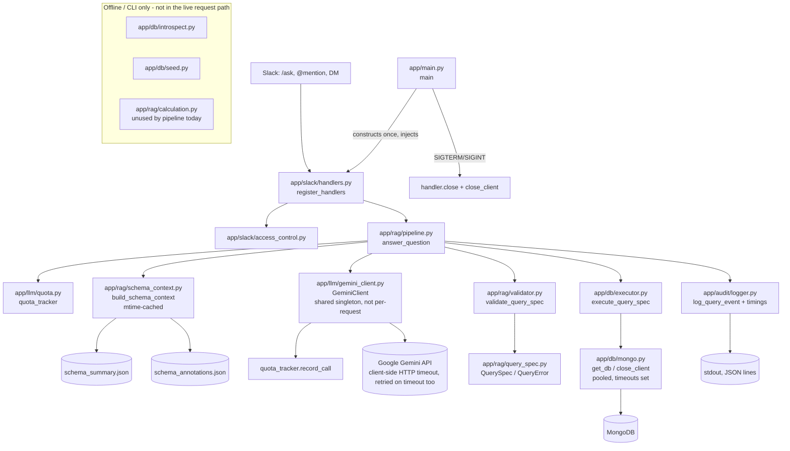
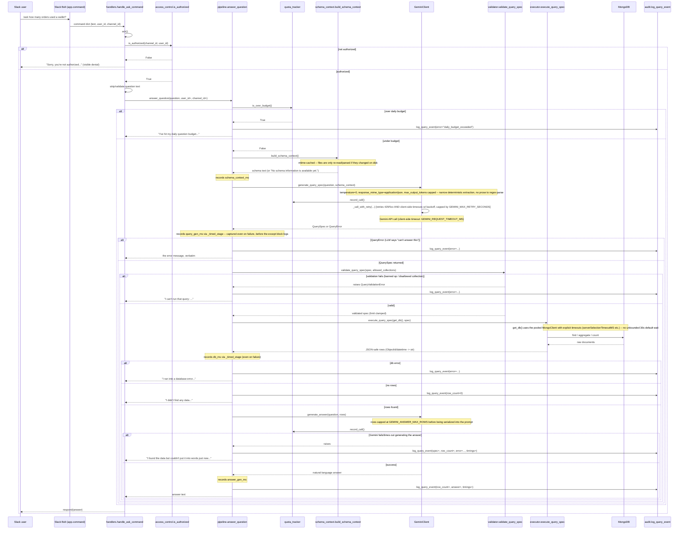
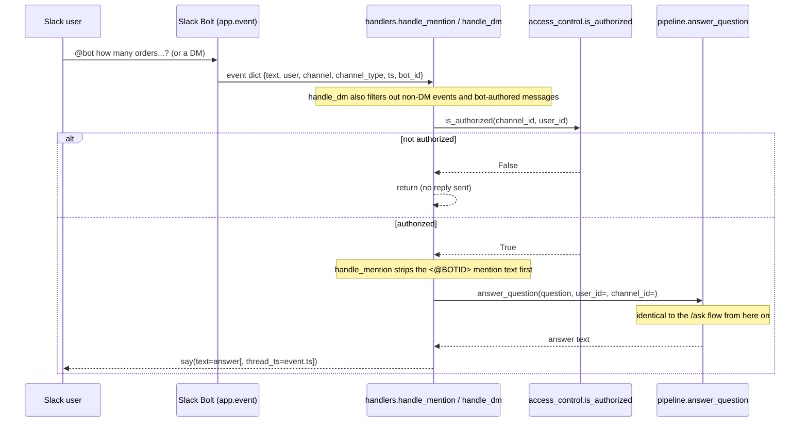

# Architecture & request flow

This traces exactly what happens for a real question end to end: which function calls which, in
order, for both entry points (`/ask` slash command and `@mention`/DM). Generated from the actual
import graph in `app/`, not from memory.

## Component map

**Note on `app/rag/calculation.py`**: it exists (pure `total`/`average`/`minimum`/`maximum`/`count`
helpers, fully unit tested) but **nothing in the live pipeline calls it**. Math currently happens
one of two ways: Gemini writes aggregation stages (`$sum`, `$avg`, etc.) directly into
`QuerySpec.pipeline`, or Gemini reasons over the raw returned rows when writing the final answer.
`calculation.py` is available for a future Python-side calculation step but isn't wired in.

**Note on client lifecycle**: `GeminiClient` used to be constructed inside `answer_question` on
every single request (`gemini or GeminiClient()`); it's now built once in `app/main.py::main()` and
injected through `register_handlers(app, gemini)` into every handler, so all questions share one
`google.genai.Client` (and its underlying HTTP transport) instead of paying client-init cost per
question. `answer_question`'s `gemini=None` default is kept only so tests can omit it / pass a
stub — production code always passes the shared instance. `MongoClient` was already a singleton
(`app/db/mongo.py::get_client`) and now additionally has explicit connection timeouts, a bounded
pool, and a `close_client()` used on graceful shutdown.

**Incident note (production): a client-side Gemini timeout on query generation**. A real production
log showed `generate_query_spec` failing after ~15.35s with `"The read operation timed out"` and
zero retries. Root cause: `httpx.ReadTimeout` (raised when `GEMINI_REQUEST_TIMEOUT_MS` elapses)
isn't a `google.genai.errors.APIError`, so `_is_retryable` didn't classify it as retryable -- a
single slow-but-transient response failed the whole question outright instead of getting a second
attempt. Fixed by extending `_is_retryable` to also treat `httpx.TimeoutException` as retryable
(bounded, as always, by `GEMINI_MAX_RETRY_SECONDS`). The same log also revealed a second, subtler
bug: the audit record's `timings` only showed `schema_context_ms`, not `query_gen_ms` -- the stage
that actually failed -- because `log_query_event` was being called (and the log line serialized)
*before* the timing block's `finally` had recorded that stage's duration. Fixed by timing each
stage with a context manager (`_timed_stage`) whose `finally` runs as the exception unwinds out of
the `with` block, i.e. strictly before the enclosing `except` clause (and therefore before
`_log`) runs. See `app/llm/gemini_client.py::_is_retryable` and
`app/rag/pipeline.py::_timed_stage`.

**Incident note (production): query-generation JSON truncated by a "thinking" model**. A second
production log showed `generate_query_spec` failing with `"Gemini response did not contain JSON:
'{\n  \"collection'"` after ~14s -- the response was cut off mid-object, no closing brace. Root
cause: the fix above introduced `max_output_tokens=512` on the query-generation call to trim
latency, but `gemini-3-flash-preview` is a "thinking" model -- by default, invisible reasoning
tokens count against `max_output_tokens` before any visible output is emitted, so the budget was
consumed by reasoning rather than by the (small) JSON the model was trying to produce, truncating
it partway through. The ~14s was mostly reasoning time, not JSON-generation time. Fixed by adding
`thinking_config=ThinkingConfig(thinking_budget=GEMINI_QUERY_THINKING_BUDGET)` (default `0` =
disabled) to `query_generation_config` -- query generation is deterministic structured extraction,
not open-ended reasoning, so it doesn't need thinking at all. Also raised
`GEMINI_QUERY_MAX_OUTPUT_TOKENS`'s default from 512 to 2048 as a safety margin (the token cap was
never the real latency lever; disabling thinking is). See
`app/llm/gemini_client.py::GeminiClient.__init__`.

## Flow 1: `/ask` slash command

## Flow 2: `@mention` and direct message

Same pipeline, different entry/exit shape. Two differences from `/ask`:
- Unauthorized access is **silent** (no reply at all), not a visible denial — deliberate, so the
  bot doesn't reveal it exists in channels it's not allowed to answer in.
- `@mention` replies in-thread (`thread_ts=event["ts"]`); DM replies directly in the DM channel.

## Function reference

Grouped by module, in call order for a typical successful request. `*` = private/internal
(leading underscore), not part of the module's public API.

### `app/main.py`
| Function | Does |
|---|---|
| `main()` | Entrypoint. Calls `configure_logging`, builds the Slack `App`, constructs **one** `GeminiClient` and passes it to `register_handlers`, registers `SIGTERM`/`SIGINT` handlers that close the Socket Mode connection and the pooled `MongoClient`, then starts `SocketModeHandler` with `concurrency=settings.slack_socket_mode_concurrency`. Logs and re-raises on fatal startup errors; `close_client()` always runs on the way out via a `finally` block. |
| `*_shutdown(signum, frame)` | Signal handler closure: logs the signal, calls `handler.close()` and `close_client()`, then raises `SystemExit(0)` to unblock `handler.start()`'s wait loop. |

### `app/slack/handlers.py`
| Function | Does |
|---|---|
| `register_handlers(app, gemini)` | Registers the three handlers below on the Bolt `app`, closing over the injected `gemini` so every handler reuses the same client instead of constructing its own. |
| `handle_mention(event, say)` | `app_mention` handler. Checks `is_authorized`, strips the `<@BOTID>` mention via `_strip_mention`, calls `answer_question(question, gemini, ...)`, replies in-thread. |
| `handle_dm(event, say)` | `message` handler, filtered to DMs only (`channel_type == "im"`, not bot-authored). Checks `is_authorized`, calls `answer_question(text, gemini, ...)`, replies. |
| `handle_ask_command(ack, respond, command)` | `/ask` handler. Acks immediately, checks `is_authorized` (visible denial if not), validates the question isn't empty, calls `answer_question(question, gemini, ...)`, responds. |
| `*_strip_mention(text)` | Regex-strips `<@USERID>` mention markup from `@mention` event text. |

### `app/slack/access_control.py`
| Function | Does |
|---|---|
| `is_authorized(channel_id, user_id)` | Returns `True` unless `SLACK_ALLOWED_CHANNEL_IDS`/`SLACK_ALLOWED_USER_IDS` are set and the caller isn't in the list. Empty lists = open to everyone. |

### `app/rag/pipeline.py` — the orchestrator
| Function | Does |
|---|---|
| `answer_question(question, gemini=None, *, user_id=None, channel_id=None)` | The whole request lifecycle: budget check -> schema context -> Gemini query generation -> validation -> execution -> Gemini answer generation, with audit logging (including per-stage timing) and a user-facing string return at every exit point (never raises to the caller, including if `generate_answer` itself fails). `gemini` is the shared instance built once in `app.main`; the `None` default exists only for tests/scripts, not production use. |
| `*_timed_stage(timings, name)` | Context manager: records elapsed ms for `name` into `timings` in its `finally` block, which runs as an exception unwinds out of the `with` block -- i.e. *before* any enclosing `except` clause (and therefore before `_log`) sees it. This ordering is what makes a failing stage's own duration show up in the audit log for that failure, instead of being silently dropped. |
| `*_log(**kwargs)` | Local closure inside `answer_question`; fills in `question`/`user_id`/`channel_id`/`duration_ms`/`timings` and calls `log_query_event`. |

### `app/llm/quota.py`
| Function | Does |
|---|---|
| `QuotaTracker.__init__(daily_budget)` | Sets up an in-process, thread-safe daily counter. |
| `QuotaTracker.record_call()` | Increments today's call count (resets first if the day rolled over). Called once per Gemini API call from inside `GeminiClient._call_with_retry`. |
| `QuotaTracker.is_over_budget()` | `True` if today's count >= budget (budget `<= 0` means unlimited). Checked by `pipeline.answer_question` before calling Gemini at all. |
| `QuotaTracker.remaining_budget()` | Calls remaining today, or `-1` if unlimited. |
| `*_reset_if_new_day()` | Resets the counter when the calendar day changes. |
| `quota_tracker` | Module-level singleton instance, constructed from `settings.gemini_daily_call_budget`. |

### `app/rag/schema_context.py`
| Function | Does |
|---|---|
| `build_schema_context(summary_path, annotations_path)` | Returns cached rendered text if neither file's mtime has changed since the last call for that `(summary_path, annotations_path)` pair; otherwise re-renders via `_render` and updates the cache. Avoids re-reading/re-parsing two JSON files on every single question while still picking up edits (e.g. re-running `introspect.py`) without a restart. |
| `*_render(summary_path, annotations_path)` | Reads `schema_summary.json` + optional `schema_annotations.json`, formats them into the prompt text Gemini sees. Returns `"No schema information is available yet."` if the summary is missing, empty, or corrupt — **this is the exact message behind the `error` field you saw in production**, meaning `schema_summary.json` doesn't exist (or is unreadable) wherever the bot process is running. |
| `*_load_json(path)` | Loads a JSON file, returning `None` for a missing file *or* malformed/empty content (catches `JSONDecodeError` — this was a bug fixed recently; it used to raise and crash the whole pipeline). |
| `*_mtime(path)` | Returns a file's mtime, or `None` if it doesn't exist; used as the cache-invalidation key. |
| `_cache` | Module-level dict: `(summary_path, annotations_path) -> (summary_mtime, annotations_mtime, rendered_text)`. |

### `app/llm/gemini_client.py`
| Function | Does |
|---|---|
| `GeminiClient.__init__(model_name=None)` | Builds the `google.genai.Client` with an explicit `http_options` timeout (`GEMINI_REQUEST_TIMEOUT_MS`), reads retry/row-cap settings from `app.config.settings`, and builds `query_generation_config` (`temperature=0`, `response_mime_type="application/json"`, `max_output_tokens=GEMINI_QUERY_MAX_OUTPUT_TOKENS`, `thinking_config=ThinkingConfig(thinking_budget=GEMINI_QUERY_THINKING_BUDGET)`) used only for `generate_query_spec` -- thinking is disabled by default since query generation is deterministic extraction, not reasoning, and on thinking-capable models reasoning tokens otherwise silently consume the output-token budget (see the incident note above the component diagram). Constructed **once** in `app.main` and shared across all requests, not per-question. |
| `GeminiClient.generate_query_spec(question, schema_context)` | Sends `_QUERY_PROMPT` to Gemini using `query_generation_config`, parses the JSON reply into a `QuerySpec` or `QueryError`. |
| `GeminiClient.generate_answer(question, rows)` | Serializes `rows` via `_rows_for_prompt` (capped at `answer_max_rows`), sends `_ANSWER_PROMPT` to Gemini, returns the natural-language reply text. |
| `*GeminiClient._call_with_retry(fn)` | Wraps any Gemini API call: records a quota call, retries on 429/5xx **and client-side timeouts** with exponential backoff + jitter up to `max_retries`, re-raises immediately on non-retryable errors, after retries are exhausted, **or if the next retry's delay would push total elapsed time past `max_retry_seconds`** — a hard wall-clock ceiling independent of the retry count. |
| `*_is_retryable(exc)` | `True` if `exc` is a `google.genai.errors.APIError` with a 429/500/502/503/504 status code, **or** an `httpx.TimeoutException` (a client-side read/connect timeout past `GEMINI_REQUEST_TIMEOUT_MS` -- this used to be treated as non-retryable, which is exactly what caused a production failure: a single slow response failed the question outright with no retry). |
| `*_extract_json(text)` | Regex-extracts the first `{...}` block from Gemini's raw text response and `json.loads`s it. |
| `*_rows_for_prompt(rows, max_rows)` | Serializes at most `max_rows` rows to JSON; if more were passed, appends an `"...N more row(s) omitted for brevity..."` note instead of the full set, so prompt size (and Gemini latency) doesn't scale unbounded with `MONGODB_MAX_RESULT_LIMIT`. |

### `app/rag/query_spec.py`
| Model | Does |
|---|---|
| `QuerySpec` | Pydantic model: `collection`, `operation` (`find`/`aggregate`/`count`), `filter`, `pipeline`, `projection`, `sort`, `limit`. What Gemini is asked to produce instead of raw MQL. |
| `QueryError` | `{error: str}` — what Gemini returns when it can't answer the question from the available schema. |

### `app/rag/validator.py` — the safety gate
| Function | Does |
|---|---|
| `validate_query_spec(spec, allowed_collections, max_limit=200)` | Rejects any collection not in the allow-list, any operation outside `find`/`aggregate`/`count`, and any use of `$where`/`$function`/`$accumulator`/`$merge`/`$out` (including inside `$lookup` targets) anywhere in the filter/pipeline/projection. Clamps `limit` into `[1, max_limit]`. Raises `QueryValidationError` on rejection. |
| `*_find_violation(value, allowed_collections)` | Recursively walks the filter/pipeline/projection structure looking for banned operators or disallowed `$lookup` targets. |

### `app/db/executor.py`
| Function | Does |
|---|---|
| `execute_query_spec(db, spec, timeout_ms=5000)` | Runs the **validated** spec against MongoDB: `count_documents`, `find(...).limit(...).max_time_ms(...)`, or `aggregate([...pipeline, {"$limit": ...}])` depending on `spec.operation`. |
| `*_to_jsonable(value)` | Recursively converts `ObjectId`/`datetime` to strings so results can be JSON-serialized (for both the Gemini answer prompt and audit logs). |

### `app/db/mongo.py`
| Function | Does |
|---|---|
| `get_client()` | Lazily creates and caches a single `MongoClient` for the process, with explicit `serverSelectionTimeoutMS`/`connectTimeoutMS`/`socketTimeoutMS`/`maxPoolSize` from settings — without these, pymongo's own default server-selection timeout is 30s, meaning an unreachable/slow Mongo could silently stall a request for up to 30s before the query even starts. |
| `get_db()` | Returns `get_client()[settings.mongodb_db_name]`. |
| `close_client()` | Closes the pooled `MongoClient` and clears the module-level singleton. Safe to call more than once (used both from the `SIGTERM`/`SIGINT` handler and from `main()`'s `finally` block). |

### `app/audit/logger.py`
| Function | Does |
|---|---|
| `configure_logging(level="INFO")` | Attaches a JSON-formatting stdout handler to the `"audit"` logger, called once at startup in `main()`. |
| `log_query_event(**fields)` | Logs one structured JSON record per question (question, user/channel IDs, the `QuerySpec` if any, error, row count, duration, per-stage `timings`, answer). This is the exact log format you're seeing in production. |
| `*_JsonFormatter.format(record)` | Turns a `LogRecord`'s `.event` dict (plus timestamp/level) into a single JSON line. |

### Not in the live request path (CLI-only tools)
| Function | Does |
|---|---|
| `app/db/introspect.py::main()` / `profile_collection()` | Samples MongoDB collections, writes `schema_summary.json`. Run manually, not by the bot process. **This is what's missing in your production environment right now.** |
| `app/db/seed.py::seed_orders()` | Demo-data generator for the `orders` collection. Dev-only. |
| `app/rag/calculation.py` | Pure math helpers, tested but not currently called from `pipeline.py` (see note above the component diagram). |
