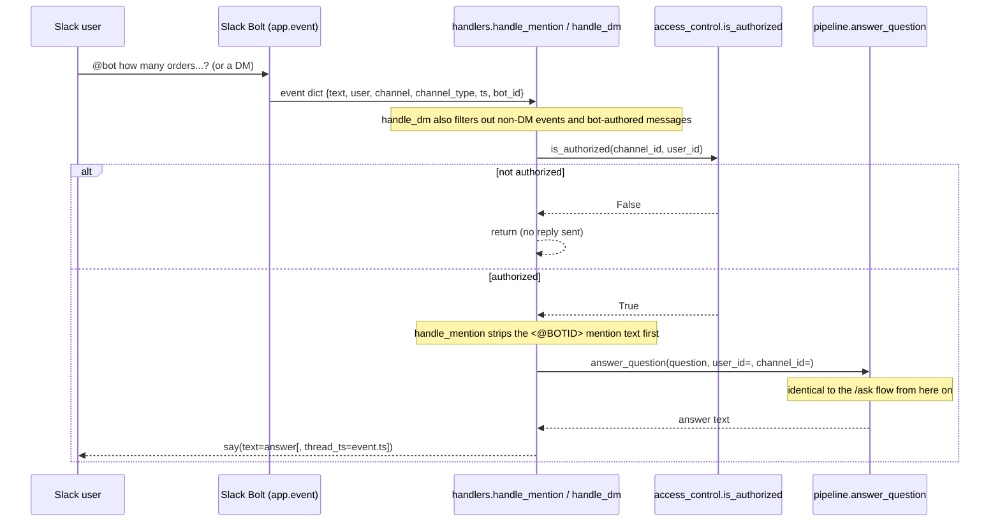

# Architecture & request flow

This traces exactly what happens for a real question end to end: which function calls which, in
order, for both entry points (`/ask` slash command and `@mention`/DM). Generated from the actual
import graph in `app/`, not from memory.

**If you only read one section**, read [Component map](#component-map) and
[The agent graph in detail](#the-agent-graph-in-detail) — everything else is detail on top of
those two.

## Component map

```mermaid
graph TD
    Main[app/main.py<br/>main] -->|configure_logging, pool_size_warning,<br/>ensure_indexes, constructs once, injects| Handlers[app/slack/handlers.py<br/>register_handlers]
    Main -->|SIGTERM/SIGINT| Shutdown[handler.close + close_client]

    Slack[Slack: /ask, @mention, DM] --> Handlers
    Handlers --> AccessControl[app/slack/access_control.py]
    Handlers --> Pipeline[app/rag/pipeline.py<br/>answer_question]

    Pipeline --> AnswerCache[app/rag/answer_cache.py<br/>per-channel TTL+LRU<br/>checked first -- a hit skips everything below]
    Pipeline --> RateLimiter[app/rag/rate_limiter.py<br/>per-(channel,user) sliding window<br/>checked before any Gemini/Mongo work]
    Pipeline --> Quota[app/llm/quota.py<br/>quota_tracker -- shared daily budget]
    Pipeline --> ClarificationCache[app/rag/clarification_cache.py<br/>per-(channel,user) pending-clarification state]
    Pipeline --> ConversationContext[app/rag/conversation_context.py<br/>per-(channel,user) last resolved_question<br/>only read when no clarification is pending]
    Pipeline --> ContextSwitch[app/rag/context_switch_cache.py<br/>per-(channel,user) pending "should I clear<br/>that context?" confirmation]
    Pipeline --> Graph[app/agents/graph.py<br/>build_graph / graph.invoke<br/>-- see detail below]
    Pipeline --> Audit[app/audit/logger.py<br/>log_query_event + timings]

    Graph --> Classifier[app/agents/classifier.py]
    Graph --> Domains[app/agents/domains.py<br/>domain registry + forced scoping]
    Graph --> QueryAgents[app/agents/query_agents.py<br/>per-domain query generation]
    Graph --> Validator[app/rag/validator.py<br/>validate_query_spec]
    Graph --> Executor[app/db/executor.py<br/>execute_query_spec]

    QueryAgents --> SchemaCtx[app/rag/schema_context.py<br/>build_domain_schema_context<br/>mtime-cached]
    SchemaCtx --> SummaryFile[(schema_summary.json)]
    SchemaCtx --> AnnotationsFile[(schema_annotations.json)]

    Classifier --> Gemini[app/llm/gemini_client.py<br/>GeminiClient<br/>shared singleton, not per-request]
    QueryAgents --> Gemini
    Graph -->|generate_answer| Gemini

    Gemini --> CircuitBreaker[app/llm/circuit_breaker.py<br/>fails fast on sustained outage]
    Gemini --> QuotaRecord[quota_tracker.record_call]
    Gemini --> GeminiAPI[(Google Gemini API<br/>client-side HTTP timeout, retried on timeout too)]

    Validator --> QuerySpecModel[app/rag/query_spec.py<br/>QuerySpec / QueryError]

    Executor --> Mongo[app/db/mongo.py<br/>get_db / close_client<br/>pooled, timeouts set]
    Mongo --> MongoDB[(MongoDB)]
    Main --> Indexes[app/db/indexes.py<br/>ensure_indexes -- idempotent, called at startup]
    Indexes --> MongoDB

    Audit --> Stdout[(stdout, JSON lines)]
    Audit -.->|AUDIT_LOG_FILE, optional| AuditFile[(rotating log file)]

    subgraph "Offline / CLI only - not in the live request path"
        Introspect[app/db/introspect.py]
        Seed[app/db/seed.py<br/>app/db/seed_users.py]
        Calc[app/rag/calculation.py<br/>unused by pipeline today]
    end
```

**Note on `app/rag/calculation.py`**: it exists (pure `total`/`average`/`minimum`/`maximum`/`count`
helpers, fully unit tested) but **nothing in the live pipeline calls it**. Math currently happens
one of two ways: Gemini writes aggregation stages (`$sum`, `$avg`, etc.) directly into
`QuerySpec.pipeline`, or Gemini reasons over the raw returned rows when writing the final answer.
`calculation.py` is available for a future Python-side calculation step but isn't wired in.

**Note on client lifecycle**: `GeminiClient` is built once in `app/main.py::main()` and injected
through `register_handlers(app, gemini)` into every handler and, from there, into
`build_graph(gemini)` (cached by identity — see `_get_graph` in `app/rag/pipeline.py` — since
compiling a `StateGraph` isn't free and the graph's structure only depends on which `GeminiClient`
it closes over). So all questions share one `google.genai.Client` instead of paying client-init
cost per question. `answer_question`'s `gemini=None` default exists only so tests can omit it /
pass a stub — production code always passes the shared instance. `MongoClient` is likewise a
process-wide singleton (`app/db/mongo.py::get_client`) with explicit connection timeouts, a
bounded pool, and `close_client()` used on graceful shutdown.

## The agent graph in detail

`app/agents/graph.py::build_graph` compiles a LangGraph `StateGraph` (schema in
`app/agents/state.py::GraphState`) that replaces what used to be a single-shot "one Gemini call
picks a collection and writes a query" pipeline. It classifies a question into one or more
*domains* (`orders`, `customers`, `vendors` — see `app/agents/domains.py`), resolves any
cross-domain geo anchor **in code**, fans out one schema-scoped agent per domain **in parallel**,
then synthesizes one answer from every domain's rows:

```mermaid
graph TD
    START --> classify[classify<br/>classify_question -> Classification]
    classify -->|low confidence, no domain,<br/>or model asked to clarify| clarify[clarify] --> END1[END]
    classify -->|context_mode=="new_topic" AND<br/>a previous_question is live| confirm[confirm_context_switch<br/>asks before discarding it -- no query yet] --> END3[END]
    classify -->|confident, and either on-topic<br/>or nothing live to discard| resolve_anchors[resolve_anchors<br/>only does real work for<br/>"vendors near &lt;customer&gt;[, with pending orders]"]
    resolve_anchors -->|Send, one per classified domain,<br/>capped at AGENT_MAX_FAN_OUT| domain_agent["domain_agent (x N, parallel)"]
    domain_agent --> synthesize[synthesize] --> END2[END]
```

- **classify** (`_classify_node` / `classify_question`): a cheap, narrow, enum-constrained call —
  the model only ever names a domain from `DOMAIN_NAMES`, never a raw collection or field, so a
  hallucinated domain fails Pydantic validation rather than being silently accepted. Also creates
  `spec_cache: {}` in state (see the dedup note below). If `state["previous_question"]` is set (the
  last resolved question for this (channel, user), from `app/rag/conversation_context.py`), the
  same call also decides `Classification.context_mode` — `"new_topic"` or `"followup"` — and, if
  `"followup"`, rewrites the question into a self-contained `Classification.resolved_question`
  that folds in only what's needed from the previous turn (e.g. "what about the total amount?"
  after "how many orders did vendor V1 have last week?" becomes "what is the total amount of
  orders vendor V1 had last week?"). `resolved_question` is written into `state["resolved_question"]`
  and every node from here on (`resolve_anchors`, `domain_agent` generation, `synthesize`) works
  against it instead of the raw `question` — see `_effective_question()`. This piggybacks on the
  classify call that already runs on every message, so an unrelated question with nothing live to
  discard costs nothing beyond the classify prompt's fixed few-shot examples: no extra Gemini call,
  and downstream stages see exactly what they would have without this feature. (When context *is*
  live, see **confirm_context_switch** below — that question isn't answered immediately either
  way.)
- **clarify** (`_route_after_classify` / `_clarify_node`): routed here if `confidence` is below
  `AGENT_CLASSIFIER_MIN_CONFIDENCE`, no domain was named, or the classifier itself asked a
  clarifying question (e.g. a geo question with no location given).
- **confirm_context_switch** (`_route_after_classify` / `_confirm_context_switch_node`): routed
  here — checked *after* the clarify conditions above, so a low-confidence/ambiguous question still
  goes to `clarify`, not this — when `Classification.context_mode == "new_topic"` **and**
  `state["previous_question"]` is set. Rather than silently discarding that context (or asking a
  fresh query for something that might have been the wrong call), it sets `answer` to a yes/no
  confirmation prompt and `needs_context_confirmation: True`, and ends the graph immediately — no
  query generated, no `generate_answer` call. `app/rag/pipeline.py` parks the candidate question in
  `context_switch_cache` and interprets the *next* message deterministically (no Gemini call) as
  yes / no / neither — see that module's docstring for the full reply-handling contract. Only
  reachable when there's actually something live to discard; with no `previous_question` a
  `"new_topic"` question goes straight to `resolve_anchors` exactly as it did before this feature
  existed.
- **resolve_anchors** (`_resolve_anchors_node`): a no-op for every question shape except the one
  named cross-domain pattern — "vendors near a customer[, with pending orders]". For that shape
  only: resolves the named customer's coordinates (a real `customers` domain query, not a
  model-invented lat/lng), then, if `orders` is also in play, which vendors are nearby (a real
  `vendors` domain query using those coordinates). This is deliberately *not* a generic multi-hop
  query planner — it's the one named pattern from the design, implemented explicitly, because a
  generic planner would be speculative machinery for cases that don't exist yet.
- **domain_agent** (`_domain_agent_node`, fanned out via `Send`, capped at `AGENT_MAX_FAN_OUT`):
  one invocation per classified domain, run in parallel by LangGraph's own executor (confirmed:
  `langgraph/pregel/_executor.py` uses a thread pool for a superstep's fanned-out tasks — this is
  not something this codebase implements itself). Each: builds a schema-scoped prompt
  (`app/agents/query_agents.py::generate_domain_query_spec`, seeing only its own domain's fields
  via `app/rag/schema_context.py::build_domain_schema_context`) → gets back a `QuerySpec` or
  `QueryError` → `scope_spec_to_domain()` forces the collection + usertype filter in code
  regardless of what the model wrote → `validate_query_spec()` → `execute_query_spec()`.
- **synthesize** (`_synthesize_node`): if every domain came back empty, picks the most useful
  "why" message (a real error beats an out-of-scope rejection beats a generic "no data" message).
  Otherwise calls `gemini.generate_answer()` with rows grouped by domain, and appends a note if
  any domain failed or was out of scope while others succeeded.

**The single most important guardrail**: `scope_spec_to_domain()` (`app/agents/domains.py`)
overwrites the spec's `collection` and `usertype` filter unconditionally, in code, after
generation — so a "vendors" question literally cannot read customer rows even if the model's own
filter forgot, or hallucinated the wrong, discriminator value. This is enforced identically for
every domain agent regardless of what schema/prompt it was given.

**Why a raw generation-time exception is not the same as a `QueryError`**
(`_generate_validate_execute`): the model can emit a shape Pydantic rejects (confirmed in
practice: an explicit `"limit": null` — see `QuerySpec._coerce_explicit_nulls_to_defaults` in
`app/rag/query_spec.py`, which now normalizes exactly this). That's a generation-time bug/model
hiccup, recorded as `errors_by_domain` (surfaced as "I ran into a problem answering that"), and
must not be presented the same way as the model's own deliberate `QueryError` ("I don't have data
for that"), which is recorded as `out_of_scope_by_domain` instead.

**Gemini-call dedup across anchor resolution and fan-out** (`spec_cache` in `GraphState`): for
the cross-domain pattern, `resolve_anchors` generates a `customers` spec (to find the anchor
customer) and, if applicable, a `vendors` spec (to find nearby vendors) — and then the fan-out
step generates specs for `customers`/`vendors`/`orders` *again*, for the final answer. The
`customers` and `vendors` generation calls in both places are identical (same domain, same
question, same geo override — they only ever differ in the `limit` applied *after* generation).
`spec_cache`, created once by `classify` and shared by reference through the `Send` payloads
`_fan_out` builds, memoizes the raw generation result per `(domain, question)` so that Gemini call
only happens once; each call site still deep-copies the cached spec before applying its own
`limit`/geo/id-filter overrides and always runs its own validate/execute independently (never
cached). See the regression test
`tests/test_graph.py::test_cross_domain_pattern_generates_each_domain_spec_only_once`, which
counts generation calls per domain to prove the dedup holds.

## Flow 1: `/ask` slash command

```mermaid
sequenceDiagram
    participant User as Slack user
    participant Bolt as Slack Bolt (app.command)
    participant H as handlers.handle_ask_command
    participant AC as access_control.is_authorized
    participant P as pipeline.answer_question
    participant AN as answer_cache
    participant RL as rate_limiter
    participant Q as quota_tracker
    participant CC as clarification_cache
    participant CX as conversation_context_cache
    participant SW as context_switch_cache
    participant G as agent graph (app/agents/graph.py)
    participant L as audit.log_query_event

    User->>Bolt: /ask how many orders used a wallet?
    Bolt->>H: command dict {text, user_id, channel_id}
    H->>H: ack()
    H->>AC: is_authorized(channel_id, user_id)
    alt not authorized
        AC-->>H: False
        H-->>User: "Sorry, you're not authorized..." (visible denial)
    else authorized
        AC-->>H: True
        H->>H: strip/validate question text
        H->>P: answer_question(question, user_id=, channel_id=)
        alt question is an exact-match reset phrase ("reset"/"new topic"/"start over"/"forget that")
            P->>CC: clarification_cache.clear(...)
            P->>CX: conversation_context_cache.clear(...)
            P->>SW: context_switch_cache.clear(...)
            P->>L: log_query_event(error="context_reset")
            P-->>H: "Got it -- I've cleared our conversation context..." (no Gemini call)
        else not a reset phrase
        P->>SW: context_switch_cache.get((channel_id, user_id))
        alt a confirmation is pending
            Note over SW: the *previous* answer asked "should I clear that context and answer this as a new question?" -- interpret this message as the reply, not a fresh question (still no Gemini call either way)
            alt exact-match yes
                P->>SW: context_switch_cache.clear(...)
                P->>CX: conversation_context_cache.clear(...)
                Note over P: question is replaced with the parked candidate_question and flows into the normal path below, as a clean standalone question
            else exact-match no
                P->>SW: context_switch_cache.clear(...)
                P->>L: log_query_event(error="context_switch_declined")
                P-->>H: "Okay, sticking with our current conversation -- go ahead." (no Gemini call)
            else neither
                P->>SW: context_switch_cache.clear(...)
                P->>CX: conversation_context_cache.clear(...)
                Note over P: stale prompt AND stale context both dropped -- this message is judged fresh, on its own, below
            end
        end
        P->>AN: answer_cache.get(channel_id, question)
        alt cache hit
            AN-->>P: CachedResult
            P->>L: log_query_event(cache_hit=True, answer=..., error=...)
            P-->>H: cached answer (zero Gemini calls, zero quota/rate-limit spent)
        else cache miss
            AN-->>P: None
            P->>RL: rate_limiter.allow((channel_id, user_id))
            alt rate limited
                RL-->>P: False
                P->>L: log_query_event(error="rate_limited")
                P-->>H: "You're asking faster than I can keep up..."
            else within rate limit
                RL-->>P: True
                P->>Q: is_over_budget()
                alt over daily budget
                    Q-->>P: True
                    P->>L: log_query_event(error="daily_budget_exceeded")
                    P-->>H: "I've hit my daily question budget..."
                else under budget
                    Q-->>P: False
                    P->>CC: clarification_cache.get((channel_id, user_id))
                    Note over CC: a pending entry means the *previous* answer was itself a clarifying question -- this message is merged with the original as one "effective_question"
                    alt no clarification pending
                        P->>CX: conversation_context_cache.get((channel_id, user_id))
                        Note over CX: the last turn's *resolved* question, if any and not yet expired -- skipped entirely when a clarification is pending, so the two context mechanisms never stack
                        CX-->>P: previous_question (or None)
                    end
                    P->>G: graph.invoke({question: effective_question, previous_question, user_id, channel_id})
                    Note over G: classify (also decides context_mode/resolved_question from previous_question) -> resolve_anchors -> fan out to domain_agent (parallel) -> synthesize -- see "The agent graph in detail" above. Internally: Gemini calls go through GeminiClient -> circuit_breaker.before_call() -> quota_tracker.record_call() -> retry/backoff -> the Gemini API.
                    alt graph.invoke raises
                        G-->>P: exception
                        alt CircuitBreakerOpenError
                            P-->>H: "I'm having trouble reaching Gemini right now..."
                        else rate-limited by Gemini (429)
                            P-->>H: "I'm getting rate-limited by Gemini right now..."
                        else other
                            P-->>H: "Sorry, I couldn't process that question right now (...)"
                        end
                        P->>L: log_query_event(error=str(exc))
                    else needs_clarification
                        G-->>P: {answer, needs_clarification: true}
                        alt clarification rounds exceeded AGENT_MAX_CLARIFICATION_ROUNDS
                            P->>CC: clarification_cache.clear(...)
                            P-->>H: "I still don't have enough information..."
                        else
                            P->>CC: clarification_cache.set(original_question, rounds+1)
                            P-->>H: the clarifying question, verbatim
                        end
                        P->>L: log_query_event(error="clarification_needed")
                    else needs_context_confirmation
                        G-->>P: {answer, needs_context_confirmation: true}
                        Note over G: confirm_context_switch node -- no query was generated for this question
                        P->>SW: context_switch_cache.set((channel_id, user_id), candidate_question=effective_question)
                        P->>L: log_query_event(error="context_switch_confirmation_needed")
                    else answered
                        G-->>P: {answer, resolved_question, specs_by_domain, rows_by_domain, errors_by_domain, out_of_scope_by_domain, timings}
                        P->>CC: clarification_cache.clear(...)
                        P->>CX: conversation_context_cache.set((channel_id, user_id), resolved_question)
                        P->>L: log_query_event(specs=, row_count=, errors_by_domain=, answer=, timings=)
                        P->>AN: answer_cache.set(cache_key, answer)
                        P-->>H: answer text
                    end
                end
            end
        end
        end
        H-->>User: respond(answer)
    end
```



## Flow 2: `@mention` and direct message

Same pipeline, different entry/exit shape. Two differences from `/ask`:
- Unauthorized access is **silent** (no reply at all), not a visible denial — deliberate, so the
  bot doesn't reveal it exists in channels it's not allowed to answer in.
- `@mention` replies in-thread (`thread_ts=event["ts"]`); DM replies directly in the DM channel.



## Function reference

Grouped by module, in call order for a typical successful request. `*` = private/internal
(leading underscore), not part of the module's public API.

### `app/main.py`
| Function | Does |
|---|---|
| `main()` | Entrypoint. Calls `configure_logging` (stdout + optional `AUDIT_LOG_FILE`), logs a warning if `settings.pool_size_warning()` returns one, calls `ensure_indexes(get_db())` (idempotent), builds the Slack `App`, constructs **one** `GeminiClient` and passes it to `register_handlers`, registers `SIGTERM`/`SIGINT` handlers that close the Socket Mode connection and the pooled `MongoClient`, then starts `SocketModeHandler` with `concurrency=settings.slack_socket_mode_concurrency`. Logs and re-raises on fatal startup errors; `close_client()` always runs on the way out via a `finally` block. |
| `*_shutdown(signum, frame)` | Signal handler closure: logs the signal, calls `handler.close()` and `close_client()`, then raises `SystemExit(0)` to unblock `handler.start()`'s wait loop. |

### `app/slack/handlers.py`
| Function | Does |
|---|---|
| `register_handlers(app, gemini)` | Registers the three handlers below on the Bolt `app`, closing over the injected `gemini` so every handler reuses the same client instead of constructing its own. |
| `handle_mention(event, say)` | `app_mention` handler. Checks `is_authorized`, strips the `<@BOTID>` mention via `_strip_mention`, calls `answer_question(question, gemini, ...)`, replies in-thread. |
| `handle_dm(event, say)` | `message` handler, filtered to DMs only (`channel_type == "im"`, not bot-authored). Checks `is_authorized`, calls `answer_question(text, gemini, ...)`, replies. |
| `handle_ask_command(ack, respond, command)` | `/ask` handler. Acks immediately, checks `is_authorized` (visible denial if not), validates the question isn't empty, calls `answer_question(question, gemini, ...)`, responds. |
| `*_strip_mention(text)` | Regex-strips `<@USERID>` mention markup from `@mention` event text. |

### `app/slack/access_control.py`
| Function | Does |
|---|---|
| `is_authorized(channel_id, user_id)` | Returns `True` unless `SLACK_ALLOWED_CHANNEL_IDS`/`SLACK_ALLOWED_USER_IDS` are set and the caller isn't in the list. Empty lists = open to everyone. |

### `app/rag/pipeline.py` — the orchestrator
| Function | Does |
|---|---|
| `answer_question(question, gemini=None, *, user_id=None, channel_id=None)` | The whole request lifecycle: **exact-match reset phrase check first** (`"reset"`/`"new topic"`/`"start over"`/`"forget that"` — clears all three conversational caches and replies immediately, no Gemini call) → **pending context-switch confirmation check** (deterministic yes/no/neither reply handling, also no Gemini call — see below) → **answer_cache check** (a hit returns immediately, before `gemini` is even constructed) → **rate_limiter check** (before any Gemini/Mongo work, so a cache hit is never penalized) → daily budget check → clarification-cache merge (a pending clarification makes this message a follow-up, not a fresh question) → **conversation-context lookup** (only when no clarification is pending — the last turn's resolved question, if any and unexpired, threaded into the graph as `previous_question` for the classifier to fold in, ignore, or trigger a confirmation over) → `graph.invoke(...)` (see "The agent graph in detail") → clarification handling (asks again, or gives up after `AGENT_MAX_CLARIFICATION_ROUNDS`) → **context-switch-confirmation handling** (parks the candidate question in `context_switch_cache` instead of answering) → `conversation_context_cache.set(...)` with the graph's `resolved_question` → audit logging (including per-stage timing and `cache_hit`) → `answer_cache.set(...)` on a real answer. Never raises to the caller — every exit point returns a user-facing string, including `graph.invoke` itself raising (distinguishes `CircuitBreakerOpenError`, a Gemini 429, and everything else into three different friendly messages). Deterministic outcomes are written back into `answer_cache`; transient/infra failures, rate-limit rejections, budget-exceeded, resets, and context-switch prompts/declines are not. `gemini` is the shared instance built once in `app.main`; the `None` default exists only for tests/scripts, not production use. |
| `*_normalize_command(question)` / `_is_reset_command` / `_is_affirmative` / `_is_negative` | Exact-match phrase detection (strip/lowercase/trim trailing `!.?`) against `_RESET_PHRASES`/`_AFFIRMATIVE_PHRASES`/`_NEGATIVE_PHRASES` — deliberately not substring/keyword matching or an LLM call, so a real question that happens to contain "reset" or "yes" still reaches the classifier instead of being swallowed. |
| `*_get_graph(gemini)` | Returns the compiled graph for this `GeminiClient`, building it once via `build_graph(gemini)` and caching by identity in a `WeakKeyDictionary` (not a plain `id()`-keyed dict — a plain dict would return a stale graph, built for a different already-garbage-collected client, once a short-lived client's `id()` gets reused, exactly what happened across the test suite's many stub clients). |
| `*_timed_stage(timings, name)` | Context manager: records elapsed ms for `name` into `timings` in its `finally` block, which runs as an exception unwinds out of the `with` block — i.e. *before* any enclosing `except` clause (and therefore before `_log`) sees it. This ordering is what makes a failing stage's own duration show up in the audit log for that failure, instead of being silently dropped. |
| `*_log(**kwargs)` | Local closure inside `answer_question`; fills in `question`/`user_id`/`channel_id`/`duration_ms`/`timings` and calls `log_query_event`. |

### `app/rag/answer_cache.py`
| Function | Does |
|---|---|
| `AnswerCache.__init__(ttl_seconds, max_entries)` | In-process, thread-safe (`threading.Lock`, same rationale as `QuotaTracker` — Socket Mode dispatches handlers via a thread pool) TTL + LRU store backed by `collections.OrderedDict`. |
| `AnswerCache.get(key)` / `.set(key, value)` | Standard TTL+LRU semantics: an expired entry is evicted on lookup (not left for later eviction pressure); `set` evicts least-recently-used entries once over `max_entries`. |
| `AnswerCache.make_key(channel_id, question)` | `(channel_id or "", question.strip().lower())` — scoped per-channel (not per-user or global — access control is already channel-scoped), keyed on exact-normalized question text, no fuzzy/semantic matching. |
| `CachedResult` | Frozen dataclass: `answer`, `error` — everything replayed on a cache hit. |
| `answer_cache` | Module-level singleton, from `settings.answer_cache_ttl_seconds`/`answer_cache_max_entries` (defaults: 30 minutes, 500 entries). |

### `app/rag/clarification_cache.py`
| Function | Does |
|---|---|
| `ClarificationCache.get/set/clear` | Same TTL+LRU shape as `answer_cache`, keyed by `(channel_id, user_id)` instead — a clarification round-trip is about one user's specific back-and-forth, not a question shareable across a channel. |
| `PendingClarification` | Frozen dataclass: `original_question`, `rounds` (how many unresolved clarification round-trips so far, gated by `AGENT_MAX_CLARIFICATION_ROUNDS`). |
| `clarification_cache` | Module-level singleton, from `settings.clarification_cache_ttl_seconds` (default 300s) / max 500 entries. |

### `app/rag/conversation_context.py`
| Function | Does |
|---|---|
| `ConversationContextCache.get/set/clear` | Same TTL+LRU shape as `answer_cache`/`clarification_cache`, keyed by `(channel_id, user_id)`. Stores a single `str` — the previous turn's `resolved_question` — never a list or growing transcript; `set` always overwrites, so an unrelated question naturally replaces stale context for the *next* turn instead of it lingering. |
| `conversation_context_cache` | Module-level singleton, from `settings.conversation_context_ttl_seconds` (default 300s) / max 500 entries. Only consulted by `pipeline.answer_question` when no clarification is pending (see `app/rag/clarification_cache.py`, which already carries context forward its own way for that case). |

### `app/rag/context_switch_cache.py`
| Function | Does |
|---|---|
| `ContextSwitchCache.get/set/clear` | Same TTL+LRU shape as the other per-conversation caches, keyed by `(channel_id, user_id)`. Holds the *candidate* question the classifier decided looked unrelated to still-live context — parked here, unanswered, until the user's next message resolves it (yes/no/neither, matched deterministically in `pipeline.py`, no Gemini call to interpret the reply). |
| `PendingContextSwitch` | Frozen dataclass: `candidate_question` — the question that would have been asked next, had it been confirmed. |
| `context_switch_cache` | Module-level singleton, from `settings.context_switch_confirmation_ttl_seconds` (default 120s) / max 500 entries. Deliberately a shorter TTL than `conversation_context_cache` — this is "waiting on an active yes/no reply right now," not general conversational memory. |

### `app/rag/rate_limiter.py`
| Function | Does |
|---|---|
| `RateLimiter.allow(key)` | `True` (and records the call) if `key` is under `limit_per_window` calls within the trailing `window_seconds`; `False` otherwise. Disabled entirely (`0` disables it, always returns `True`) when `limit_per_window <= 0`. Sliding window via a `deque` of call timestamps per key, trimmed on each check; LRU-evicts old keys past `max_tracked_keys` (default 1000) so memory doesn't grow unbounded across many distinct users. |
| `RateLimiter.make_key(channel_id, user_id)` | `(channel_id or "", user_id or "")`. |
| `rate_limiter` | Module-level singleton, from `settings.user_rate_limit_per_minute`/`user_rate_limit_window_seconds` (default: disabled). Independent of `quota_tracker` below — this bounds one identity's rate; that bounds a shared daily total. |

### `app/llm/quota.py`
| Function | Does |
|---|---|
| `QuotaTracker.record_call()` | Increments today's call count (resets first if the day rolled over). Called from inside `GeminiClient._call_with_retry`, but *after* the circuit breaker's `before_call()` — a fast-failed call never reaches Gemini, so it shouldn't spend budget either. |
| `QuotaTracker.is_over_budget()` | `True` if today's count ≥ budget (`<= 0` means unlimited). Checked by `pipeline.answer_question` before calling the graph at all. |
| `quota_tracker` | Module-level singleton, from `settings.gemini_daily_call_budget`. Shared across every user — see `rate_limiter` above for the per-user complement. |

### `app/llm/circuit_breaker.py`
| Function | Does |
|---|---|
| `CircuitBreaker.before_call()` | No-op if `failure_threshold <= 0` (disabled) or the breaker is closed. Raises `CircuitBreakerOpenError` if open and still within `cooldown_seconds`. After cooldown, lets exactly one "half-open" trial call through by clearing the open state — a failure re-opens it (via `record_failure`), a success clears it fully (via `record_success`). |
| `CircuitBreaker.record_success()` / `.record_failure()` | Reset / increment the consecutive-failure counter; `record_failure` opens the breaker once the counter hits `failure_threshold`. |
| `gemini_circuit_breaker` | Module-level singleton, from `settings.gemini_circuit_breaker_threshold`/`gemini_circuit_breaker_cooldown_seconds` (default: 5 failures, 30s cooldown). Deliberately process-wide, not per-`GeminiClient`-instance — production shares exactly one client, and the failure signal is about the shared backend, not any particular object. |

### `app/llm/gemini_client.py`
| Function | Does |
|---|---|
| `GeminiClient.__init__(model_name=None)` | Builds the `google.genai.Client` with an explicit `http_options` timeout (`GEMINI_REQUEST_TIMEOUT_MS`), reads retry/fallback-model/row-cap settings, and builds `query_generation_config` (`temperature=0`, `response_mime_type="application/json"`, `max_output_tokens=GEMINI_QUERY_MAX_OUTPUT_TOKENS`, `thinking_config=ThinkingConfig(thinking_budget=GEMINI_QUERY_THINKING_BUDGET)`) used for every structured-extraction call (classification, every domain agent) — thinking is disabled by default since these are deterministic extraction, not open-ended reasoning, and on thinking-capable models reasoning tokens otherwise silently consume the output-token budget (see incident note below). |
| `GeminiClient.generate_structured(prompt, schema)` | Sends `prompt`, parses the JSON reply into `schema(**data)`. Used by the classifier. |
| `GeminiClient.generate_structured_or_error(prompt, schema)` | Like `generate_structured`, but treats a `{"error": "..."}` reply as a `QueryError` instead of validating it against `schema`. Used by every domain agent. |
| `GeminiClient.generate_answer(question, rows_by_domain)` | Serializes `rows_by_domain` via `_rows_for_prompt` (capped at `answer_max_rows` *per domain*, so one chatty domain can't crowd the others out of the prompt), sends `_ANSWER_PROMPT`, returns the natural-language reply. |
| `*GeminiClient._generate_content(contents, config)` | Tries `model_name`, then each `GEMINI_FALLBACK_MODELS` entry in order — but only advances on a 429/404 (`_is_model_unavailable`; Google's free-tier quota is per-model, so a model out of quota doesn't affect a different model's quota). Any other failure (timeout, 5xx exhausted) propagates immediately instead of cascading through every fallback. Drops `thinking_config` for fallback models (confirmed: a different model 400s on `thinking_budget=0`, a value the primary model accepts). |
| `*GeminiClient._call_with_retry(fn)` | `gemini_circuit_breaker.before_call()` (raises immediately if the breaker is open) → `quota_tracker.record_call()` → retries on 429/5xx **and client-side timeouts** with exponential backoff + jitter up to `max_retries`, re-raising immediately on non-retryable errors, after retries are exhausted, or if the next retry's delay would push total elapsed time past `max_retry_seconds`. Records exactly one circuit-breaker success/failure per call (not per internal retry attempt), so routine retried-then-recovered calls don't inflate the consecutive-failure count. |
| `*_is_retryable(exc)` | `True` for a `google.genai.errors.APIError` with a 429/500/502/503/504 status, **or** an `httpx.TimeoutException` (a client-side timeout — this used to be non-retryable, which caused a real production failure: a single slow response failed the question outright with no retry). 429 is deliberately excluded from automatic escalation logic elsewhere — see `is_rate_limited`. |
| `is_rate_limited(exc)` | `True` only for a 429 — lets `pipeline.py` show a clean "I'm getting rate-limited" message instead of Google's raw error payload. |
| `*_extract_json(text)` / `*_rows_for_prompt(rows, max_rows)` | Regex-extracts the first `{...}` block and `json.loads`s it; caps serialized rows per domain, appending an `"...N more row(s) omitted..."` note instead of the full set. |

### `app/agents/classifier.py`
| Function | Does |
|---|---|
| `classify_question(gemini, question, previous_question=None)` | Enum-constrained structured call: the model names zero or more domains from `DOMAIN_NAMES` (never a raw collection/field), plus `needs_geo`, `confidence`, an optional `clarification_question`, and (see below) `context_mode`/`resolved_question`. Deliberately narrow — never sees per-domain schema detail, only domain names, so it stays fast and isn't itself a source of field-level hallucination. When `previous_question` is given (from `app/rag/conversation_context.py`), it's shown to the model as one extra prompt line; when omitted, the prompt is unchanged from before this parameter existed. Backfills `resolved_question` to `question` if the model leaves it blank. |
| `Classification` | Pydantic model: `domains: list[DomainName]`, `needs_geo: bool`, `confidence: float`, `clarification_question: str \| None`, `context_mode: Literal["new_topic", "followup"]` (default `"new_topic"`), `resolved_question: str` (default `""`, backfilled by `classify_question`). `context_mode` is `"followup"` only when the current question can't stand on its own without `previous_question` (no subject of its own, "what about...", a different aggregate of the same thing just asked about); `resolved_question` is the question verbatim for `"new_topic"`, or a self-contained rewrite folding in just what's needed from `previous_question` for `"followup"` — never a growing transcript, always exactly one turn's worth of prior context. |

### `app/agents/domains.py` — the domain registry
| Function | Does |
|---|---|
| `DOMAINS` | `{"orders": ..., "customers": ..., "vendors": ...}` — `customers`/`vendors` share the physical `users` collection, distinguished only by `usertype` (1/2); each carries its own `schema_fields` subset so a domain-scoped agent never sees the other domain's exclusive fields. |
| `scope_spec_to_domain(spec, domain)` | **The single most important guardrail in this system**: forces `spec.collection` and, if set, merges a forced `usertype` filter — deterministically, in code, regardless of what the model produced. |
| `merge_forced_filter(spec, forced)` | Merges a code-supplied filter predicate so it can't be overridden by the model's own filter/pipeline — a `$match` prepended for `aggregate`, an `$and` wrapper for `find`/`count`. Used both by `scope_spec_to_domain` (usertype) and by `app/agents/graph.py` (resolved vendor/customer ids for the cross-domain pattern). |
| `allowed_collections()` / `geo_allowed_fields()` | Derive `validate_query_spec`'s allow-lists from `DOMAINS` itself, so there's one source of truth instead of a second hand-maintained list. |

### `app/agents/query_agents.py`
| Function | Does |
|---|---|
| `generate_domain_query_spec(gemini, domain, question)` | Builds a prompt scoped to `domain`'s collection and `schema_fields` only (via `build_domain_schema_context`), asks Gemini for a `QuerySpec` or `{"error": ...}`, then always runs the result through `scope_spec_to_domain` before returning — so nothing this call produces can escape its domain even if the prompt itself were somehow defeated. |

### `app/agents/graph.py` and `app/agents/state.py`
See ["The agent graph in detail"](#the-agent-graph-in-detail) above for the full node-by-node
breakdown (`_classify_node`, `_confirm_context_switch_node`, `_resolve_anchors_node`,
`_fan_out`/`_domain_agent_node`, `_synthesize_node`, and the `spec_cache` dedup). `GraphState` (a
`TypedDict`) is the graph's schema; fields without an `Annotated` reducer are "last write wins,"
fields with `Annotated[..., _merge_dicts]` (`specs_by_domain`, `rows_by_domain`,
`out_of_scope_by_domain`, `errors_by_domain`, `timings`) accumulate across the parallel
`domain_agent` fan-out instead of one overwriting another. `previous_question` (input, optional)
and `resolved_question` (written once by `_classify_node`) are both plain last-write-wins fields;
`*_effective_question(state)` returns `resolved_question` if set, else the raw `question`, and is
what `_resolve_anchors_node`, `_fan_out`, and `_synthesize_node` all call instead of reading
`state["question"]` directly. `needs_context_confirmation` (set only by
`_confirm_context_switch_node`) mirrors `needs_clarification`'s shape and is mutually exclusive
with it — `_route_after_classify` picks at most one of `clarify` / `confirm_context_switch` /
`resolve_anchors` per invocation.

### `app/rag/schema_context.py`
| Function | Does |
|---|---|
| `build_domain_schema_context(collection, fields, ...)` | Schema context scoped to one collection, optionally further scoped to a field subset — this is what each domain agent actually sees, and is itself a hallucination guardrail: a customer-domain agent never shown `rating`/`business_name` has no way to accidentally reference them. |
| `build_schema_context(...)` | Unscoped, full-collection version — kept for tooling/tests; the live agent pipeline always uses the domain-scoped version above. |
| `*_load_schema_data(summary_path, annotations_path)` | Returns cached data if neither file's mtime has changed since the last call for that path pair; otherwise re-reads and updates the cache. Avoids re-reading/re-parsing two JSON files on every single question while still picking up edits (e.g. re-running `introspect.py`) without a restart. |
| `*_load_json(path)` | Loads a JSON file, returning `None` for a missing file *or* malformed/empty content (catches `JSONDecodeError` rather than crashing the whole pipeline). |

### `app/rag/query_spec.py`
| Model | Does |
|---|---|
| `QuerySpec` | Pydantic model: `collection`, `operation` (`find`/`aggregate`/`count`), `filter`, `pipeline`, `projection`, `sort`, `limit`, `start_date`/`end_date` (descriptive-only ISO dates for the date-range guardrail), `geo_near`/`requested_radius_m` (structured "nearby" intent — see `GeoNear` — the model describes coordinates/radius as data; it never writes raw `$near`/`$geoNear` syntax). A `model_validator` coerces explicit `null` on `filter`/`pipeline`/`limit` to their defaults, since a field default only applies when the key is *absent*, not when it's explicitly `null` — confirmed as a real model quirk (pattern-matching the genuinely-optional nulls nearby). |
| `GeoNear` | `field`, `longitude`, `latitude`, `max_distance_m` — validated the same way dates are (reject out-of-scope fields, clamp an over-broad radius) in `app/rag/validator.py`. |
| `QueryError` | `{error: str}` — what a domain agent returns when it can't answer the question from its own schema. |

### `app/rag/validator.py` — the safety gate
| Function | Does |
|---|---|
| `validate_query_spec(spec, allowed_collections, ..., geo_allowed_fields=None, max_geo_radius_m=50_000)` | Rejects any collection not in the allow-list, any operation outside `find`/`aggregate`/`count`, and any use of `$where`/`$function`/`$accumulator`/`$merge`/`$out` (including inside `$lookup` targets) anywhere in the filter/pipeline/projection. Enforces the date-range guardrail (`_validate_date_range`) and the geo-radius guardrail (`_validate_geo_near`). Clamps `limit` into `[1, max_limit]` — or `[1, min(max_limit, no_date_range_limit_cap)]` (default 100) when neither `start_date` nor `end_date` is set. Raises `QueryValidationError` on rejection. |
| `*_validate_geo_near(spec, geo_allowed_fields, max_radius_m)` | No-op if `geo_near` isn't set. Otherwise rejects a `geo_near.field` not recognized for that collection (per `app/agents/domains.py::geo_allowed_fields()`) or a non-positive `max_distance_m`, and clamps an over-broad radius down to `max_radius_m` rather than rejecting it outright — same "reject what's out of scope, clamp what's too broad" pattern as the date-range check. |
| `*_validate_date_range(spec, max_range_days)` | No-op if neither date is set. If both are set, the span is `end - start` (raises if `end < start`). If only one is set, the span is measured against **today**, not the missing bound (an `end_date` alone is normally a bound in the past, so anchoring a missing `start_date` to today would misreport it as an inverted range). Raises past `max_range_days`. |

### `app/db/executor.py`
| Function | Does |
|---|---|
| `execute_query_spec(db, spec, timeout_ms=5000)` | Runs the **validated** spec: `count_documents`, `find(...).limit(...).max_time_ms(...)`, or `aggregate([...pipeline, {"$limit": ...}])`. If `spec.geo_near` is set, prepends a `$geoNear` stage (aggregate — must be first) or adds a `$near` filter clause (find/count) built from the structured `GeoNear` data, never from anything the model wrote directly. |
| `*_to_jsonable(value)` | Recursively converts `ObjectId`/`datetime` to strings so results can be JSON-serialized (for both the Gemini answer prompt and audit logs). |

### `app/db/mongo.py`
| Function | Does |
|---|---|
| `get_client()` | Lazily creates and caches a single `MongoClient` for the process, with explicit `serverSelectionTimeoutMS`/`connectTimeoutMS`/`socketTimeoutMS`/`maxPoolSize` from settings — without these, pymongo's own default server-selection timeout is 30s, meaning an unreachable/slow Mongo could silently stall a request for up to 30s before the query even starts. |
| `get_db()` | Returns `get_client()[settings.mongodb_db_name]`. |
| `close_client()` | Closes the pooled `MongoClient` and clears the module-level singleton. Safe to call more than once (used both from the `SIGTERM`/`SIGINT` handler and from `main()`'s `finally` block). |

### `app/db/indexes.py`
| Function | Does |
|---|---|
| `ensure_indexes(db)` | Idempotent: creates indexes on `orders.customer_id`/`vendor_id`/`status`/`created_at` and `users.user_id`/`usertype`/`(location, 2dsphere)` — exactly the fields every domain agent's generated filters hit. Called from `app.main` on every startup (not just first-run seeding), so these exist even against a pre-populated database that was never seeded through this repo's scripts. |

### `app/audit/logger.py`
| Function | Does |
|---|---|
| `configure_logging(level="INFO", log_file="", max_bytes=10MB, backup_count=5)` | Attaches a JSON-formatting stdout handler to the `"audit"` logger (checked by exact handler type, not just "any handler present," so something else already attached to the logger — e.g. a test framework's own log-capture handler — isn't mistaken for "already configured"). If `log_file` is set, also attaches a `RotatingFileHandler` (idempotent per distinct path) so records survive a process restart instead of existing only in however stdout happens to be captured. |
| `log_query_event(**fields)` | Logs one structured JSON record per question (question, user/channel IDs, per-domain `QuerySpec`s if any, error, `errors_by_domain`, row count, duration, per-stage `timings`, answer, `cache_hit`). |
| `*_JsonFormatter.format(record)` | Turns a `LogRecord`'s `.event` dict (plus timestamp/level) into a single JSON line. |

### `app/config.py`
| Function | Does |
|---|---|
| `Settings.__init__` | Loads and validates every environment variable this app uses, via `_require` (raises naming the missing var), `_int`/`_float` (raise naming both the var and the bad value, instead of a bare `ValueError` that doesn't say which of the ~30 settings is at fault), and `_parse_list` (comma-separated, empty = `[]`). |
| `Settings.pool_size_warning()` | Returns `None` if `mongodb_max_pool_size` covers the worst case (every Socket Mode worker thread simultaneously fanning out to `agent_max_fan_out` domain queries at once), otherwise a human-readable warning string. Checked explicitly at startup (`app.main`), not asserted in `__init__` — a too-small pool is a performance warning, not something that should crash the process. |

### Not in the live request path (CLI-only tools)
| Function | Does |
|---|---|
| `app/db/introspect.py::main()` / `profile_collection()` | Samples MongoDB collections, writes `schema_summary.json`. Run manually, not by the bot process. |
| `app/db/seed.py::seed_orders()` / `app/db/seed_users.py::seed_users()` | Demo-data generators for `orders`/`users`. Both call `ensure_indexes()` after inserting, so a freshly seeded database has the same indexes production would. Dev-only. |
| `app/rag/calculation.py` | Pure math helpers, tested but not currently called from the live pipeline (see note above the component diagram). |

## Historical incident notes

These describe real production bugs that shaped specific pieces of the current design — kept
because the *fix* only makes sense in light of the *failure*, and because the same class of bug
is easy to reintroduce without the context.

**A client-side Gemini timeout on query generation.** A production log showed query generation
failing after ~15.35s with `"The read operation timed out"` and zero retries. Root cause:
`httpx.ReadTimeout` (raised when `GEMINI_REQUEST_TIMEOUT_MS` elapses) isn't a
`google.genai.errors.APIError`, so `_is_retryable` didn't classify it as retryable — a single
slow-but-transient response failed the whole question outright instead of getting a second
attempt. Fixed by extending `_is_retryable` to also treat `httpx.TimeoutException` as retryable
(bounded, as always, by `GEMINI_MAX_RETRY_SECONDS`). The same log also revealed a second, subtler
bug: the audit record's `timings` only showed the stage *before* the one that actually failed,
because `log_query_event` was being called (and the log line serialized) *before* the timing
block's `finally` had recorded that stage's duration. Fixed by timing each stage with a context
manager (`_timed_stage`) whose `finally` runs as the exception unwinds out of the `with` block —
strictly before the enclosing `except` clause (and therefore before `_log`) runs. See
`app/llm/gemini_client.py::_is_retryable` and `app/rag/pipeline.py::_timed_stage`.

**Query-generation JSON truncated by a "thinking" model.** A second production log showed query
generation failing with `"Gemini response did not contain JSON: '{\n  \"collection'"` after ~14s —
the response was cut off mid-object, no closing brace. Root cause: a token-cap tuned to trim
latency (512) was consumed by invisible reasoning on a "thinking" model
(`gemini-3-flash-preview`) before any visible output was emitted, truncating the JSON partway
through — the ~14s was mostly reasoning time, not JSON-generation time. Fixed by adding
`thinking_config=ThinkingConfig(thinking_budget=GEMINI_QUERY_THINKING_BUDGET)` (default `0` =
disabled) — query generation is deterministic structured extraction, not open-ended reasoning, so
it doesn't need thinking at all — and raising `GEMINI_QUERY_MAX_OUTPUT_TOKENS`'s default to 2048
as a safety margin (the token cap was never the real latency lever; disabling thinking is). See
`app/llm/gemini_client.py::GeminiClient.__init__`.

**A model emitting `"limit": null` instead of omitting the field.** Confirmed in production: the
model sometimes writes an explicit `null` for a field with a real default (pattern-matching the
several genuinely-optional `null` fields nearby, like `start_date`/`geo_near`) rather than
omitting the key or using the example value shown in the prompt. Pydantic only applies a field
default when the key is *absent*, not when it's explicitly `null`, so this hard-failed the whole
question on a benign, non-adversarial model quirk. Fixed by a `model_validator` in `QuerySpec`
(`_coerce_explicit_nulls_to_defaults`) that coerces `null` back to the default for `filter`,
`pipeline`, and `limit` specifically — the fields that actually have real defaults, as opposed to
`geo_near`/`projection`/`sort`/etc., which are meant to be nullable already. The same production
run also surfaced the *general* version of this problem: a raw generation-time exception (like
the `ValidationError` this would otherwise have raised) must be recorded as a genuine per-domain
error, not the friendly "out of scope" rejection a deliberate `QueryError` gets — otherwise a
model/schema bug looks, to the end user, identical to "I don't have data for that." See
`app/rag/query_spec.py::QuerySpec._coerce_explicit_nulls_to_defaults` and
`app/agents/graph.py::_generate_validate_execute`'s `out_of_scope` distinction.
